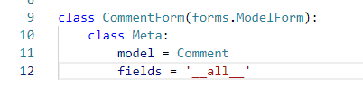

# 1) 1:N DB 관계 오전강의 개념

## 0. 목차

1. 개념수업
   1. 왜래키의 개념에 대해
   2. comment 모델 개요
2. 코드수업
   1. comment model 등록하기
   2. 댓글 생성 연습하기
   3. admin에 등록
   4. CommentForm 작성
   5. detail 페이지에서 CommentForm 변경하러 가기
   6. 댓글 작성 로직 만들기
   7. Comment READ
   8. Comment DELETE

## 1. 외래키의 개념에대해 

"한 테이블의 필드가 다른 테이블의 행을 식별할 수 있는 키"

우리는 댓글다는 작업을 하려고 하는데 1:N 관계가 지금

`1이 article이고, N이 comment 임!!!`

댓글 데이터베이스가 따로 있고, 개별 댓글에 대해서 아티클의 어디 db에 연결되는지를 기재하는(FK로 기재- forgin key) 방식인거야

따라서 왜래키는 댓글 db에 있다. 

오늘은 그래서 comment 모델을 만들거고 왜래키도 사용해볼거야

## 2. comment 모델 개요

```
class Comment(models.Model):
    article = models.ForeignKey(Article, on_delete=models.CASCADE)
    content = models.CharField(max_length=200)
    created_at = models.DateTimeField(auto_now_add=True)
    updated_at = models.DateTimeField(auto_now=True)

    def __str__(self):
        return self.content
```

# 2) 1:N DB1 관계 오전강의 코드흐름

## 1. comment model 등록하기

####  위 모델 등록하고 makemigration, migrate 진행하기

왜래키는 `모델명_id`로 표현됨 !!

article을 단수로 쓰는 이유

1. 누구를 참조하는지 모델명을 확인하기 위함
2. 다른 모델 관계와 헷갈리지 않을 수 있음 => 1:N 관계인지 N:N인지 (N:N은 복수형쓰거든)


## 2. 댓글 생성 연습하기

```
1. 댓글의 내용
2. 어떤 게시글에 달린건지 (어떤 게시글을 참조하는지)
3. 누가 달았는지 (오후)
```

1. pip install ipython
2. python manage.py shell_plus 실행
3. shell_plus에서 댓글 하나 만들기

## 3. admin에 등록

```
from django.contrib import admin
from .models import Article, Comment

admin.site.register(Article)
admin.site.register(Comment)
```

## 4. CommentForm 작성

```
class CommentForm(forms.ModelForm):
    class Meta:
        model = Comment
        fields = '__all__'
```

## 5. detail 페이지에서 CommentForm 출력

articles/views.py

```
def detail(request, article_pk):
    article = get_object_or_404(Article, pk=article_pk)
    comment_form = CommentForm()
    context = {
        'article':article,
        'comment_form': comment_form,
    }
    return render(request, 'articles/detail.html', context)
```

articles/detail.html

이 코드를 추가하기

```
<form action="" method="POST">
    
    {{ comment_form }}
    <input type="submit">
</form>
```

근데 이렇게 하면 ?? 이런 식으로 나온다:


어떤 게시글에 쓸지까지도 지금 선택을 하도록 나와있는거야

이러면안되지 이상하니까 => CommentForm을 바꿔주러 가야됨ㄴ

## 6. CommentForm 변경하러 가기



이랬던 코드를 all을 바꿀거임


아래와 같이 변한다


## 7. 댓글 작성 로직 만들기

articles/urls.py

```
path('<int:article_pk>/comments/', views.comments_create, name='comments_create'),
```

articles/detail.html

```
댓글 작성란에 action 부분에 url넣어주기
 작성
```

articles/views.py

```
def comments_create(request, article_pk):
    article = Article.objects.get(pk=article_pk)
    comment_form = CommentForm(request.POST)
    if comment_form.is_valid():
        comment_form.save()
    return redirect('articles:detail', article.pk)
```

이렇게 쓰고 서버 켜서 댓글을 써보면 

다음과 같은 에러가 뜨는데 ... !!


이 에러는 너 지금 몇번 글에 댓글을 쓰는거니 ? 라는 뜻의 에러임

그럴수밖에 .. 지금 하나 내용 넣는 부분을 폼으로 숨겼ㅅ으니까 

이때 views. 함수에 사용해주는 것이  commit다,.


db에 실제 데이터베이스에 저장을 하는 과정을 commit이라고 하는데 

실제 데이터베이스에 저장은 안하고 대신 인스턴스를 만들어 주는 것을  commit 상태의 False로 적용해주는 것이다 

데이터베이스에 아직 저장은 안했고 인스턴스만 남겨서 다음 변수에서 값을 받아와 저장하도록 한다. 

## 8. comment READ

댓글이 detail에 출력이 되어야될듯

조회한 article의 모든 댓글을 조회해야됨 => `역참조`

article/views.py

detail 함수 부분을 다음과 같이 코드 추가해주기


articles/drtail.html

```
<hr>
<h4>댓글 목록</h4>
<ul>
    
        <li>{{ comment.content }}</li>
    
</ul>
<hr>
```

## 9. comment DELETE

articles/urls.py

```
path('<int:article_pk>/comments/<int:comment_pk>/delete', views.comments_delete, name='comments_delete'),
```

articles/views.py

```
def comments_delete(request, article_pk, comment_pk):
    comment = Comment.objects.get(pk=comment_pk)
    comment.delete()
    return redirect('articles:detail', article_pk)
```

articles/detail.html

```
<form action="" method="POST">
                
                <input type="submit" value="delete">
</form>
```


이부분 추가한거임

이렇게 쓰고 이제 한번 페이지 띄워서 삭제버튼 눌러보면? 잘된다

데이터베이스에서도 삭제가  잘됨

