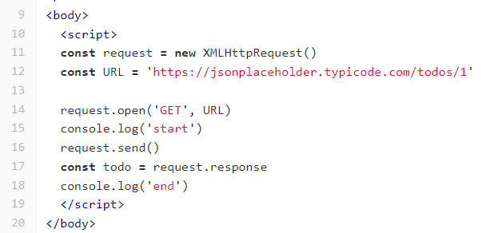

# 0503 lecture

# 0. 목차 

1. AJAX

2. XML Http Request

3. 동기식과 비동기식 + Threads

4. Blocking & Non - Blocking

5. Concurrency model

6. 코드동작과정 상세

7. callback function

8. Promise

9. Axios

    

# 1. AJAX

#### Asynchronous Javascript And XML

데이터 가져와서 비동기식 운영하는 자바스크립트 정도로 생각하면 됨 ...

여기서 XML은 이제 dataset을 표현하는 방식인데 XML을 자주 옛날에 써가지고 이런 이름이 붙은거고 사실

모든 데이터 유형을 다룰 수 있음 그래서 여기서는 JSON을 쓸 거임

 

AJAX 특징이라면 ? : page를 새로고침하는 거 없이 서버에 요청이 가능한 방식임 이것이 바로 "비동기성"

AJAX 는 요청을 XML Http Requests 로 보냄

 

# 2. XML Http Request : XHR

사용자의 작업을 방해하지 않으면서 페이지 일부를 업데이트 할 수 있음 (데이터 종류 상관없이 다 가져올 수 잇음)

가벼운 예제를 보자면 이런거:

11. 브라우저에 탭 하나 열고 
12. url 을 상수에 할당

14. url을 주소창에 치고 get요청으로 보내는 준비를 하기
15. 요청 보내기

근데 이제 여기서 17번 줄이 18번줄보다 늦게 동작이 돼 그 이유는 3번에서 말해줌

 

# 3. 동기식과 비동기식 + Threads

#### 느낌만 생각하면 됨

1. 동기식 : 직렬 구조 - 하나 작업이 끝나고 다음 작업이 실행됨
2. 비동기식 : 병렬 구조 - 특정 작업에 대해서  Web API에 맡기고 작업을 건너뛰어 하는 경우가 있음

 

#### Tread란 ?

프로그램이 작업을 완료하기 위해 사용할 수 있는 단일 프로세스

js는 single thread임 => 이벤트를 처리하는 call stack이 하나라는 뜻 !!! 단일 스레드는 한번에 하나의 작업만 수행이 가능함 (다음 작업을 시작하려면 반드시 앞의 작업이 끝나야 된다는 뜻)

함수를 공식적으로 스테이지에 올리는 곳 => call stack이라 생각하면 됨 여기 안올라가면 계속 작업이 대기상태라 보면 됨

이때 비동기식은 이런느낌임 : (집안일을 하는 사람은 하나고 식세기 로봇청소기 .. 얘네들이 작업을 하고 최종 확인및 마무리는 사람이 하는)

 

# 4. Blocking & Non-Blocking

blocking이란? : 코드가 끝날때까지 넘어갈수가 없음 (파이썬이 보통 그런식이었음)

js중에서 몇몇 메서드가 비동기식 운영을 하고 있음 (ajax 나 시간 관련된 동작)

 

# 5. Concurrency model

js가 비동기로 메서드를 처리하기 위해 동작하는 흐름에 이제 데이터가 임시로 왔다가 가는 곳들이 있음:

`Web API`, `Task Queue`, `Event Loop`, `Call Stack`

1. 즉시 처리하지 못하는 이벤트가 있으면 Web API로 보내서 처리를 하고
2. 처리가 되면 Task Queue에 대기시킨다음
3. Call Stack이 비는 순간  Event Loop 가 큐에서 가장 오래된 (제일 앞의) 이벤트를 call stack으로 보냄

이 네가지 모델이 `Concurrency model` 동시성모델

`Web API` : JS 엔진이 아닌 브라우저 영역에서 제공하는 API

`Task Queue` : 비동기 처리된 callback함수가 일이 끝날때까지 대기하고 있는 곳

(js는 동기식이니까 대기하는 애들을 그 자리에서 기다리지 않고 큐로 보낸다음 후속 코드를 이어서 읽어야됨)

`Event Loop` : cctv라 생각하면 될듯 => call stack이나 task queue에 데이터가 대기하거나 뭐 그런걸 확인하고 대기자들 가야되는 곳에 적절히 보내고 배치하고 하는 역할

 `Call Stack` : 요청이 들어올 때마다 해당 요청을 LIFO로 보내는

 

나머지 필기는 내일 이어서 추가하기