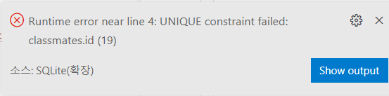

# SQL0314 lecture

# 0. 목차

1. SQL 분류 (DDL/ DML/ DCL)
2. CRUD 이전 sql 환경 사용해보기
3. CRUD_Create
3. CRUD_Read
3. CRUD_Delete
3. CRUD_Update
3. CRUD정리
3. WHERE

# 1. SQL 분류 (DDL/ DML/ DCL)

## DDL(data definintion language) 

데이터 정의 언어 => 테이블 + 스키마 정의명령어

CREATE + DROP + ALTER

## DML(data manipulation language) 

데이터 조직 언어 =>  SQL에서 CRUD 하기 위한 언어 

INSERT + SELECT + UPDATE + DELETE

## DCL(data control language)

데이터 제어 언어 => 사용자의 권한 제어를 위해 사용

GRANT + REVOKE + COMMIT + ROLLBACK


# 2. CRUD 이전 sql 환경 사용해보기

## 1. 테이블 생성작업 in prompt

### 1. db 생성하기

csv 불러오고 => sqlite3 tutorial.sqlite3 명령어 실행했을 때 쉘 환경이 오픈되고 

여기서 .database 입력하면 `tutorial.sqlite3` 라는 이름의 db가 생성됨

```
sqlite3 db이름.sqlite3 (쉘환경 오픈)
.database (db 생성)
```

cf) 여기서 명령어 앞에 사용하는 `.` 은 sqlite 프로그램의 기능(쉘의 기능적인 부분들을 실행하도록 하는 것)

### 2. csv파일을 table으로 만들기

```
.mode csv
.import 파일명.csv examples
.tables
```

csv를 임포트 하기 전 csv모드를 활성화하기 위해 `.mode csv ` 를 작성

그대음 `.import 파일명.csv examples` 작성

여기서 csv를 테이블로 가져오기 위해서 import 작성해주고 example이라는 테이블에 담는다는 명시하기 위해 끝에 테이블 이름 (examples)을 작성해주기

그렇게 하고 `.tables` 사용해서 테이블 불러오면 examples 라고 뜨게 될거임

그리고 sqlite 파일 opendatabase 해가지고 테이블 확인해보기

### 3. 간단하게 crud 중 READ 작업 해보기

```
SELECT * FROM examples;
```

cf) `;` 까지 하나의 SQL query(명령)로 간주됨

여기서 `*` 은 `전체`를 의미함

즉 저 문장은 examples 테이블의 모든 데이터를 조회한다는 뜻이 되고

`SELECT` 문은 특정 테이블의 레코드(행) 정보를 반환함

### 4. 뷰모드 변경하기

1. `.headers on`  :  레코드정보의 헤더가 반환됨
2. `.mode column ` :  배쉬에서 헤더를 포함해 틀을 갖춘 데이터를 볼 수 있음


## 2. 테이블 생성/삭제작업 in query file

### 1. 배쉬에서 사용하는 명령어들을 쿼리 파일에서 작성하고 명령하기

sqlite explorer 에서 원하는 db위에 커서를 두고 오른쪽 마우스 클릭 => New Query 선택하면 쿼리 파일이 생성됨 (물론 저장은 따로 해줘야됨)

명령어 실행은 두가지 있음 (쿼리 전체 실행 + 부분실행)

1. 전체실행 : Run Query
2. 부분실행 : 원하는 쿼리를 드래그하고 Run Selected Query

하면 어떤 데이터베이스에서 실행할거냐는 콤보박스 나타나고 원하는 db를 선택하면 됨

이제 여기에 쿼리문 쓰고 실행하고 하면 됨

### 2. db 내 테이블 생성 + 스키마 조회

```
CREATE TABLE classmates (
    id INTEGER PRIMARY KEY,
    name TEXT
);
```

CREATE TABLE classmates () => `CREATE TABLE` 하고 테이블명 작성, ()안에는 스키마 작성하기

프롬프트에서 .schema 작성하면 헤더도 볼 수 있음 `.schema 테이블명`

### 3. db 내 테이블 삭제

```
DROP TABLE classmates;
```

# 3. CRUD_Create

### 1. INSERT

특정 테이블에 레코드(행)을 삽입 (생성이라고도 함)

```
INSERT INTO classmates (name, age) VALUES ('홍길동', 23);
INSERT INTO classmates VALUES ('홍길동', 30, '서울');
```

`컬럼 VALUES 값 ` 을 사용해서 insert 해도 되고, 

모든 값을 저장하는거면 바로 `VALUES 값` 사용해도 됨 (컬럼 명시 안해도 됨)

### 2. id (primary key)를 보고싶을때

```
SELECT rowid, * FROM classmates;
```

rowid) primary key 속성의 컬럼을 작성하지 않았을때 자동으로 생성되는 컬럼

### 3. 비어있는 곳이 있으면 안됨 (NotNull 설정 필요)

처음에 스키마를 지정해줄때 줄 하나하나 모두 Not Null을 지정해줄 필요가 있음

```
CREATE TABLE classmates (
  id INTEGER PRIMARY KEY,
  name TEXT NOT NULL,
  age INT NOT NULL,
  adress TEXT NOT NULL
);
```

### 4. pk 설정해서 스키마 형성할 때 주의점 2가지

1. pk설정할때는 꼭 데이터타입이 integer여야 됨 !!!

2. 그리고 insert 실행할때 이제는 데이터만 넣으면 안됨: pk도 고려를 해야된다는 것이다 => 입력할 pk컬럼을 명시하는 방법 2가지:

   1. insert 할 때 id값도 함께 명시해주기

      ```
      INSERT INTO classmates VALUES (1, '홍길동', 30, '서울');
      ```

      이거할때 id 값을 일일이 기억해줘야된다는 성가심이 있음
   
      pk는 고유값이어야되니까 중복값을 입력하게 되면 다음의 에러가 발생
   
      
   
      그리고 만약에 pk값을 헷갈려가지고 나중id 먼저 썼다가 앞에 아이디 다시 쓰면 (예를 들어서 3 먼저 썼다가 2 다시 쓰면) 먼저 id 순으로 정렬이 됨
   
   2. 각 value에 맞는 컬럼을 앞에 작성해주기
   
      ```
      INSERT INTO classmates (name, age, adress) VALUES ('홍길동', 30, '서울');
      ```

### 5. 여러 데이터를 insert 하고 싶을때

```
INSERT INTO classmates VALUES 
('홍길동', 30, '서울'),
('김철수', 28, '대전'),
('이싸피', 24, '광주'),
('김싸피', 31, '구미'),
('김현주', 45, '부울경');
```


# 4. CRUD_Read

## 1. SELECT

```
SELECT 보고싶은 컬럼들 추가 FROM 테이블이름;
```

### 2. 셀렉트 문과 함께 사용하는 clause (절)

1. LIMIT : 쿼리에서 반환되는 행 수를 제한 (특정 행부터 시작해서 조회하기 위해 OFFSET 키워드와 함께 사용하기도 함)

   ```
   SELECT rowid, name FROM classmates LIMIT 1;
   ```

   이거는 offset을 같이 안 써줘가지고 맨 위의 행부터 보여주게 됨 

   이제 특정 행부터 보고싶다면 offset을 사용해야됨

   ```
   SELECT rowid, name FROM classmates LIMIT 2 OFFSET 2;
   ```

   pk가 3번인 id 부터 2개의 행을 보여주는 쿼리

   여기서 지금 offset 3이라고 해야  2번행부터 보여주는 모습

   왠지알지 ? offset이란 `시작지점부터 몇번 가야 조회지점이 나오는지를 확인`하는거니까 

   시작지점인 1번에서부터 2칸 넘어간 3부터 볼수있는 모습이라는거

   <br>

2. WHERE : 쿼리에서 반환된 행에 대한 특정 검색 조건을 지정함

   ```
   SELECT 컬럼들 FROM 테이블이름 WHERE 조건;
   ```

   ```
   SELECT rowid, name FROM classmates WHERE adress = '서울';
   ```

   그니까 특정 행 값이  서울인 행을 다 보여준다 이말임

   <br>

3. SELECT DISTINCT : 조회 결과에서 중복되는 행을 제거

   ```
   SELECT DISTINCT age FROM classmates;
   ```

   이렇게 하면 나이 컬럼에서 중복되는 값 제한 데이터만 보여줌 

   DISTINCT는 꼭 SELECT옆에 써야되고 이거는 그냥 단일 컬럼 조회밖에 안되는듯

### 3. rowid에 제한이 있을까? 

900경 개 있음

# 5. CRUD_Delete

## 1. DELETE

```
DELETE FROM 테이블 WHERE 조건;
```

조건에 해당하는 레코드(행)를 삭제함

이때 밑의 데이터가 위로 올라오지 않음 그냥 구멍뚫리듯이 비워지기만 함.. 또한 이 비워진 부분은 재활용이 가능합

```
예를 들어서 rowid가 5인 레코드를 지웠다쳐 그러면 
5가 비워진상태로 1 2 3 4 6 7 .. 이렇게 데이터가 있고
나중에 레코드 인서트를 할때 5번으로 넣는다고 명시를 해주면 거기로 들어갈 수 있게 됨
```

이게 장고랑 다른 부분인데, 장고에서는 데이터를 재활용하지 않았거든

## 2. id 재사용 이슈 처리 : AUTOINCREMENT

sqlite는 기본적으로 id값을 재사용할수 있음 

그러면 장고에서처럼 재사용 없이 사용하지 않은 다음 행 값을 사용하게 하려면 어떻게 해야될까 ?

컬럼 속성을 추가해야됨: `AUTOINCREMENT` 

그니까 로우아이디에서는 불가능하고, pk 값을 지정해줄때 primary key 속성을 작성해주고 옆에 autoincrement 속성을 함꼐 추가해주라는 뜻

```
CREATE TABLE classmates (
  id INTEGER PRIMARY KEY AUTOINCREMENT
  name TEXT NOT NULL,
  age INT NOT NULL,
  adress TEXT NOT NULL
);
```

이게 바로 장고에서 사용하는 pk 속성값입니다

## 3. 장고에서 sql 사용 어떻게?

우리 모델 변경할때 말이야

예를들어서 모델에 title + content 만 있다고 쳐 근데 이제 우리가 created_at을 추가하고 싶단 말이지 ?

그러면 그거를 추가를 해주고 makemigrations + migrate를 하게 되잖어 ?

근데 이때 sql상으로는 세로운 컬럼이 추가된 테이블을 하나더만들어 

그리고 기존 테이블에 정보를 옮겨오고 NOTNULL 이니까 새로운 컬럼에 비워지는 데이터는 나름대로 채워주고

기존 테이블을 아예 새로운 테이블로 바꿔주는거임 ALTER를 사용합니다

# 6. CRUD_Update

```
UPDATE 테이블명 SET 헤더명='바꿀값',.. WHERE 조건;
```

근데 이제 where에서 바꾸려고 할때 보통 pk기준으로 바꾸기는 해

# 7. CRUD정리

|      |  구분  |                       예시                        |
| :--: | :----: | :-----------------------------------------------: |
|  C   | INSERT | INSERT INTO 테이블명 (컬럼 , ..) VALUES (값, ..); |
|  R   | SELECT |        SELECT * FROM 테이블명 WHERE 조건;         |
|  U   | UPDATE |    UPDATE 테이블명 SET 컬럼=값, .. WHERE 조건;    |
|  D   | DELETE |         DELETE FROM 테이블명 WHERE 조건;          |

# 8. WHERE

## 1. 작업 전 데이터 불러오기

1. user 테이블 지정하기

   ```
   CREATE TABLE users (
     first_name TEXT NOT NULL,
     last_name TEXT NOT NULL,
     age INTEGER NOT NULL,
     country TEXT NOT NULL,
     phone TEXT NOT NULL,
     balance INTEGER NOT NULL
   );
   ```

2. csv 임포트는 터미널에서 작업하기

   ```
   .mode csv
   .import users.csv users
   ```

## 2. WHERE

특정 조건으로 데이터를 조회함

```
SELECT * FROM users WHERE age = 30;
```

두개 이상의 조건을 활용해 조회

```
SELECT 컬럼명 FROM 테이블명 WHERE 조건1 AND 조건2;
```

```
SELECT age, last_name FROM users WHERE age >= 30 AND last_name='김';
```

# 9. Aggregate Functions

집계함수이고 

여러 행으로부터 `하나의 결과` 를 반환하는 함수임 => `SELECT 구문에서만` 사용됨

1. COUNT

   그룹의 항목 수를 가져옴

   ```
   SELECT COUNT 컬럼 FROM 테이블명;
   ```

   그러면 NULL값도 셀까? 이거 확인해보기 => 아예 안되지 왠줄알아? 이거지금 눌값이 없다고 가정한 상태에서 진행하고 있는거니까 그냥 바보같은 질문일 뿐이지

   <br>

2. AVG/ MAX/ MIN/ SUM

   ```
   SELECT AGGR(컬럼) FROM 테이블이름;
   ```

   

# 10. LIKE

like 는 와일드카드 캐릭터와 함께 씀

```
SELECT * FROM 테이블명 WHERE 컬럼명 LIKE 와일드카드패턴;
```

```
SELECT * FROM users WHERE age LIKE '2_';
```


와일드카드 캐릭터 2개 : `%` `_`

1.  `%` 해당 자리에 문자열이 없을수도 있음
2.  `_` 해당자리에 꼭 '하나의' 문자가 존재해야됨

| 패턴 예시            | 의미                                          |
| -------------------- | --------------------------------------------- |
| 2%                   | 2로 시작하는 값                               |
| %2                   | 2로 끝나는 값                                 |
| %2%                  | 2가 들어가는 값                               |
| _2%                  | 아무 값이 하나 있고 두 번째가 2로 시작하는 값 |
| 1___                 | 1으로 시작하고 총 4자리인 값                  |
| `2_%_%`    /  `2__%` | 2로 시작하고 적어도 3자리인 값                |


# 11. ORDER_BY

조회결과의 집합을 정렬 => SELECT 문에 추가해서 사용함

키워드 두개

1. ASC = 오름차순

2. DESC = 내림차순

```
SELECT * FROM 테이블명 ORDER BY 컬럼 카워드;
```

# 12. GROUP BY

문장에 WHERE 절이 포함된다면 반드시 WHERE절 뒤에 작성해야 됨

```
SELECT last_name, COUNT(*) FROM users GROUP BY last_name;
```

이건 지금 그거임 : 뭐냐면

last name 컬럼 별로 각 요소들이 몇개씩 있는지를 조회하는 것인데

GROUP BY 뒤에 오는 칼럼을 기준으로 이것을 정하고 

SELECT last_name, COUNT(*) 이 부분은 지금 그 성씨가 제일 처음 나온 레코드의 lastname을 비춰주는 것

```
SELECT last_name, COUNT(*) AS name_count FROM users GROUP BY last_name;
```

 AS name_count 를 사용해서 헤더에 COUNT(*) 라고 나오는걸 name_count 라고 비춰줄 수 있음

# 13. ALTER TABLE

ALTER의 3가지 기능

1. 테이블 이름 변경

   ```
   ALTER TABLE 기존 테이블명 RENAME TO 새로운 테이블명;
   ```

2. 테이블에 새로운 컬럼 추가

   ```
   ALTER TABLE 테이블명 ADD COLUMN 추가할 컬럼명 데이터타입 NOT NULL DEFAULT '기본값이 될 내용 추가';
   ```

   야 컬럼 타입은 변경못함 .. 처음 설정할때 잘 설정해주자

3. 컬럼 이름 수정

   ```
   ALTER TABLE 테이블명 RENAME COLUMN 기존이름 TO 새로운 컬럼명;
   ```

   
