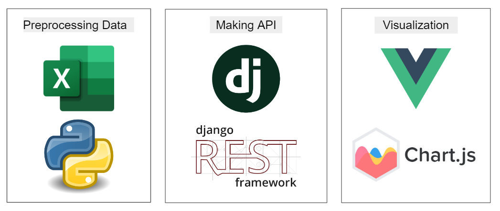

# [2022. 06. 23 ~ ] Toy Project 1

이 프로젝트에서는 관세청 수출입 품목 데이터를 수집하여 api로 만들어보는 작업을 진행했습니다. [과정 기록](./Report)

## source

https://www.data.go.kr/data/3040156/fileData.do

## 사용한 기술스택

1. python, excel으로 데이터 전처리를 진행하였습니다.
2. django로 REST API를 구성하였습니다. 
3. vue와 chart.js로 대시보드를 구성하였습니다.

## 느낀점

1. 다음 프로젝트에서는 **파이프라인 구축**을 하는 것이 목표이다 : 적은 양의 데이터라도 자동화해서 받아오고, 저장하고, 그거를 대시보드에 반영하는것까지 해보고 싶음 + 파이프라인 공부가 필요함
2. 욕심내서 데이터 양을 많이 수집하지 말기 => 로직에 집중하는것이 중요한 것 같다
3. 데이터 양을 많이 수집하고 싶으면 기간을 넉넉하게 잡고 만들기, 로직을 분명히 하고 수집하기

## 궁금한점

1. 데이터 분석과 나열은 어느 기준으로 구분해야되는걸까?? : 대시보드에는 어떤 정보까지 실어야 되는걸까? 예측값만 싣지 않으면 되는건지, 아니면 초기 데이터를 가지고 간단한 계산을 한 결과까지도 실으면 안되는지 그 경계를 모르겠음

# 참고

[머신러닝 파이프라인에서 데이터 전처리 방법](https://bcho.tistory.com/1380)