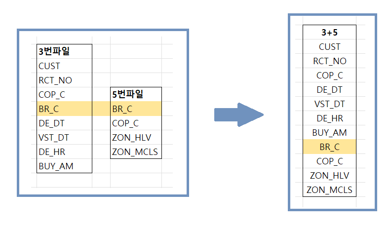
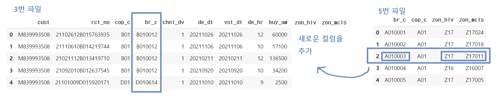
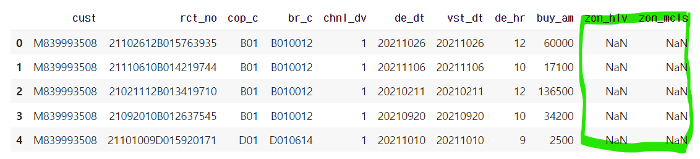
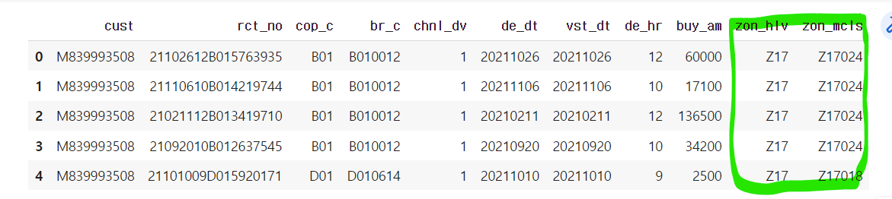

# [220630] 

220629에서 진행했던 전처리를 pandas로 작업하였습니다. 

## 0. 목차

1. 데이터 설명
2. 코드 설명

## 1.데이터 설명

사용한 데이터 : `3번파일`  `5번파일`  => 모두 csv 형태로 되어있음

**개요**



`3번 파일의 br_c` 컬럼을 기준으로 `5번 파일의 br_c` 에서 해당하는 행을 찾아 `zon_hlv`, `zon_mcls` 를 연결하는 작업을 진행



## 2. 코드 설명

```python 
# 3번 / 5번 파일 가져오기
csv_03 = pd.read_csv('/content/drive/MyDrive/Colab Notebooks/LPOINT_BIG_COMP_03_COP_U.csv')
csv_05 = pd.read_csv('/content/drive/MyDrive/Colab Notebooks/LPOINT_BIG_COMP_05_BR.csv')
```

```python
# 03번 파일에 'zon_hlv', 'zon_mcls' 컬럼 추가
import numpy as np
csv_03['zon_hlv'] = np.NaN
csv_03['zon_mcls'] = np.NaN
csv_03.head()
```



nan 값으로 채워진 새로운 컬럼이 생성됨

```python
for i in range(len(csv_03)):  # 3번 파일 값 각각에 적용하기 위해 for문 사용
    
  try:
    # br_c_03 변수를 만들어서 3번 파일의 br_c값을 할당하고
    br_c_03 = csv_03.iloc[i].br_c
    
    # 5번파일에서 br_c_03에 해당하는 행의 번호를 가져와서 
    keyval = csv_05.index[csv_05['br_c'] == br_c_03][0]    
    
	# 각각 zon_hlv 컬럼 + zon_mcls 컬럼의 i번째 셀에 값을 넣기
    csv_03.loc[i, 'zon_hlv'] = csv_05.zon_hlv[keyval]
    csv_03.loc[i, 'zon_mcls'] = csv_05.zon_mcls[keyval]
   
  # 없는 값을 처리하기 위해 try-except 사용 : 없는 값은 '-'로 채우기
  except:
    csv_03.loc[i, 'zon_hlv'] = '-'
    csv_03.loc[i, 'zon_mcls'] = '-'
    
  print(i)
```

```python
# csv 파일으로 내보내기
csv_03.to_csv("csv_03.csv")
```


## 결과 사진

