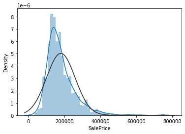
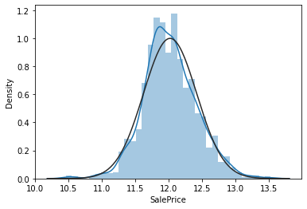
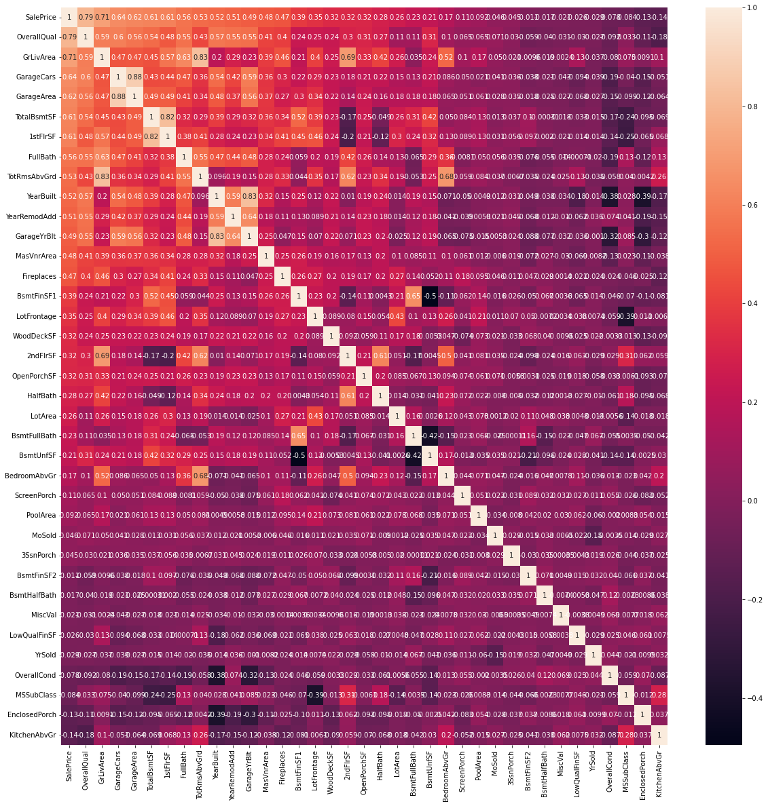
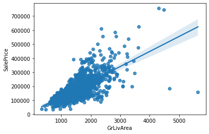

```python
import pandas as pd
import numpy as np
from scipy.stats import norm
%matplotlib inline
import matplotlib.pyplot as plt
import seaborn as sns
import warnings; warnings.simplefilter('ignore')
```


```python
train = pd.read_csv('train.csv', index_col='Id')
test = pd.read_csv('test.csv', index_col='Id')
submission = pd.read_csv('sample_submission.csv', index_col='Id')
data = train
print(train.shape, test.shape, submission.shape)
```

    (1460, 80) (1459, 79) (1459, 1)
    


```python
#target class 확인 (SalePrice) 
train.head()
```


<div>
<style scoped>
    .dataframe tbody tr th:only-of-type {
        vertical-align: middle;
    }

    .dataframe tbody tr th {
        vertical-align: top;
    }

    .dataframe thead th {
        text-align: right;
    }
</style>
<table border="1" class="dataframe">
  <thead>
    <tr style="text-align: right;">
      <th></th>
      <th>MSSubClass</th>
      <th>MSZoning</th>
      <th>LotFrontage</th>
      <th>LotArea</th>
      <th>Street</th>
      <th>Alley</th>
      <th>LotShape</th>
      <th>LandContour</th>
      <th>Utilities</th>
      <th>LotConfig</th>
      <th>...</th>
      <th>PoolArea</th>
      <th>PoolQC</th>
      <th>Fence</th>
      <th>MiscFeature</th>
      <th>MiscVal</th>
      <th>MoSold</th>
      <th>YrSold</th>
      <th>SaleType</th>
      <th>SaleCondition</th>
      <th>SalePrice</th>
    </tr>
    <tr>
      <th>Id</th>
      <th></th>
      <th></th>
      <th></th>
      <th></th>
      <th></th>
      <th></th>
      <th></th>
      <th></th>
      <th></th>
      <th></th>
      <th></th>
      <th></th>
      <th></th>
      <th></th>
      <th></th>
      <th></th>
      <th></th>
      <th></th>
      <th></th>
      <th></th>
      <th></th>
    </tr>
  </thead>
  <tbody>
    <tr>
      <th>1</th>
      <td>60</td>
      <td>RL</td>
      <td>65.0</td>
      <td>8450</td>
      <td>Pave</td>
      <td>NaN</td>
      <td>Reg</td>
      <td>Lvl</td>
      <td>AllPub</td>
      <td>Inside</td>
      <td>...</td>
      <td>0</td>
      <td>NaN</td>
      <td>NaN</td>
      <td>NaN</td>
      <td>0</td>
      <td>2</td>
      <td>2008</td>
      <td>WD</td>
      <td>Normal</td>
      <td>208500</td>
    </tr>
    <tr>
      <th>2</th>
      <td>20</td>
      <td>RL</td>
      <td>80.0</td>
      <td>9600</td>
      <td>Pave</td>
      <td>NaN</td>
      <td>Reg</td>
      <td>Lvl</td>
      <td>AllPub</td>
      <td>FR2</td>
      <td>...</td>
      <td>0</td>
      <td>NaN</td>
      <td>NaN</td>
      <td>NaN</td>
      <td>0</td>
      <td>5</td>
      <td>2007</td>
      <td>WD</td>
      <td>Normal</td>
      <td>181500</td>
    </tr>
    <tr>
      <th>3</th>
      <td>60</td>
      <td>RL</td>
      <td>68.0</td>
      <td>11250</td>
      <td>Pave</td>
      <td>NaN</td>
      <td>IR1</td>
      <td>Lvl</td>
      <td>AllPub</td>
      <td>Inside</td>
      <td>...</td>
      <td>0</td>
      <td>NaN</td>
      <td>NaN</td>
      <td>NaN</td>
      <td>0</td>
      <td>9</td>
      <td>2008</td>
      <td>WD</td>
      <td>Normal</td>
      <td>223500</td>
    </tr>
    <tr>
      <th>4</th>
      <td>70</td>
      <td>RL</td>
      <td>60.0</td>
      <td>9550</td>
      <td>Pave</td>
      <td>NaN</td>
      <td>IR1</td>
      <td>Lvl</td>
      <td>AllPub</td>
      <td>Corner</td>
      <td>...</td>
      <td>0</td>
      <td>NaN</td>
      <td>NaN</td>
      <td>NaN</td>
      <td>0</td>
      <td>2</td>
      <td>2006</td>
      <td>WD</td>
      <td>Abnorml</td>
      <td>140000</td>
    </tr>
    <tr>
      <th>5</th>
      <td>60</td>
      <td>RL</td>
      <td>84.0</td>
      <td>14260</td>
      <td>Pave</td>
      <td>NaN</td>
      <td>IR1</td>
      <td>Lvl</td>
      <td>AllPub</td>
      <td>FR2</td>
      <td>...</td>
      <td>0</td>
      <td>NaN</td>
      <td>NaN</td>
      <td>NaN</td>
      <td>0</td>
      <td>12</td>
      <td>2008</td>
      <td>WD</td>
      <td>Normal</td>
      <td>250000</td>
    </tr>
  </tbody>
</table>
<p>5 rows × 80 columns</p>
</div>


```python
sns.distplot(data['SalePrice'], fit=norm)
```


    <AxesSubplot:xlabel='SalePrice', ylabel='Density'>


    

    


```python
sns.distplot(np.log(data['SalePrice']), fit=norm)
```


    <AxesSubplot:xlabel='SalePrice', ylabel='Density'>


    

    


```python
d_corr = data.corr()
top_corr = data[d_corr.nlargest(80,'SalePrice')['SalePrice'].index].corr()
fig, ax_1 = plt.subplots(nrows=1, ncols=1)
fig.set_size_inches(20,20)
sns.heatmap(top_corr, annot=True, ax=ax_1)
```


    <AxesSubplot:>


    

    


```python
sns.regplot(data['GrLivArea'], data['SalePrice'])
```


    <AxesSubplot:xlabel='GrLivArea', ylabel='SalePrice'>


    

    


```python
train=train.drop(train[(train['GrLivArea']>4000) & (train['SalePrice']<300000)].index) 
train=train.drop(train[(train['GarageArea']<1000) & (train['SalePrice']>700000)].index) 
train=train.drop(train[(train['TotalBsmtSF']>5000) & (train['SalePrice']<300000)].index) 
train=train.drop(train[(train['YearRemodAdd']>1990) & (train['SalePrice']>650000)].index) 
train=train.drop(train[(train['GarageYrBlt']>1980) & (train['SalePrice']>650000)].index) 
train=train.drop(train[(train['MasVnrArea']<1400) & (train['SalePrice']>650000)].index) 
train=train.drop(train[(train['BsmtUnfSF']<1500) & (train['SalePrice']>700000)].index) 
```


```python
from sklearn.model_selection import train_test_split
ytrain=train['SalePrice']
ytrain=np.log(ytrain+1)
train.drop(['SalePrice'], axis=1, inplace=True)
```


```python
all_data=pd.concat((train, test), axis=0)
```


```python
all_data.head()
```


<div>
<style scoped>
    .dataframe tbody tr th:only-of-type {
        vertical-align: middle;
    }

    .dataframe tbody tr th {
        vertical-align: top;
    }

    .dataframe thead th {
        text-align: right;
    }
</style>
<table border="1" class="dataframe">
  <thead>
    <tr style="text-align: right;">
      <th></th>
      <th>MSSubClass</th>
      <th>MSZoning</th>
      <th>LotFrontage</th>
      <th>LotArea</th>
      <th>Street</th>
      <th>Alley</th>
      <th>LotShape</th>
      <th>LandContour</th>
      <th>Utilities</th>
      <th>LotConfig</th>
      <th>...</th>
      <th>ScreenPorch</th>
      <th>PoolArea</th>
      <th>PoolQC</th>
      <th>Fence</th>
      <th>MiscFeature</th>
      <th>MiscVal</th>
      <th>MoSold</th>
      <th>YrSold</th>
      <th>SaleType</th>
      <th>SaleCondition</th>
    </tr>
    <tr>
      <th>Id</th>
      <th></th>
      <th></th>
      <th></th>
      <th></th>
      <th></th>
      <th></th>
      <th></th>
      <th></th>
      <th></th>
      <th></th>
      <th></th>
      <th></th>
      <th></th>
      <th></th>
      <th></th>
      <th></th>
      <th></th>
      <th></th>
      <th></th>
      <th></th>
      <th></th>
    </tr>
  </thead>
  <tbody>
    <tr>
      <th>1</th>
      <td>60</td>
      <td>RL</td>
      <td>65.0</td>
      <td>8450</td>
      <td>Pave</td>
      <td>NaN</td>
      <td>Reg</td>
      <td>Lvl</td>
      <td>AllPub</td>
      <td>Inside</td>
      <td>...</td>
      <td>0</td>
      <td>0</td>
      <td>NaN</td>
      <td>NaN</td>
      <td>NaN</td>
      <td>0</td>
      <td>2</td>
      <td>2008</td>
      <td>WD</td>
      <td>Normal</td>
    </tr>
    <tr>
      <th>2</th>
      <td>20</td>
      <td>RL</td>
      <td>80.0</td>
      <td>9600</td>
      <td>Pave</td>
      <td>NaN</td>
      <td>Reg</td>
      <td>Lvl</td>
      <td>AllPub</td>
      <td>FR2</td>
      <td>...</td>
      <td>0</td>
      <td>0</td>
      <td>NaN</td>
      <td>NaN</td>
      <td>NaN</td>
      <td>0</td>
      <td>5</td>
      <td>2007</td>
      <td>WD</td>
      <td>Normal</td>
    </tr>
    <tr>
      <th>3</th>
      <td>60</td>
      <td>RL</td>
      <td>68.0</td>
      <td>11250</td>
      <td>Pave</td>
      <td>NaN</td>
      <td>IR1</td>
      <td>Lvl</td>
      <td>AllPub</td>
      <td>Inside</td>
      <td>...</td>
      <td>0</td>
      <td>0</td>
      <td>NaN</td>
      <td>NaN</td>
      <td>NaN</td>
      <td>0</td>
      <td>9</td>
      <td>2008</td>
      <td>WD</td>
      <td>Normal</td>
    </tr>
    <tr>
      <th>4</th>
      <td>70</td>
      <td>RL</td>
      <td>60.0</td>
      <td>9550</td>
      <td>Pave</td>
      <td>NaN</td>
      <td>IR1</td>
      <td>Lvl</td>
      <td>AllPub</td>
      <td>Corner</td>
      <td>...</td>
      <td>0</td>
      <td>0</td>
      <td>NaN</td>
      <td>NaN</td>
      <td>NaN</td>
      <td>0</td>
      <td>2</td>
      <td>2006</td>
      <td>WD</td>
      <td>Abnorml</td>
    </tr>
    <tr>
      <th>5</th>
      <td>60</td>
      <td>RL</td>
      <td>84.0</td>
      <td>14260</td>
      <td>Pave</td>
      <td>NaN</td>
      <td>IR1</td>
      <td>Lvl</td>
      <td>AllPub</td>
      <td>FR2</td>
      <td>...</td>
      <td>0</td>
      <td>0</td>
      <td>NaN</td>
      <td>NaN</td>
      <td>NaN</td>
      <td>0</td>
      <td>12</td>
      <td>2008</td>
      <td>WD</td>
      <td>Normal</td>
    </tr>
  </tbody>
</table>
<p>5 rows × 79 columns</p>
</div>


```python
check_null = all_data.isna().sum() / len(all_data)
check_null[check_null >=0.3]
```


    Alley          0.932075
    FireplaceQu    0.487136
    PoolQC         0.997256
    Fence          0.804460
    MiscFeature    0.963979
    dtype: float64


```python
remove_cols = check_null[check_null >= 0.3].keys()
all_data = all_data.drop(remove_cols, axis=1)
all_data.head()
```


<div>
<style scoped>
    .dataframe tbody tr th:only-of-type {
        vertical-align: middle;
    }

    .dataframe tbody tr th {
        vertical-align: top;
    }

    .dataframe thead th {
        text-align: right;
    }
</style>
<table border="1" class="dataframe">
  <thead>
    <tr style="text-align: right;">
      <th></th>
      <th>MSSubClass</th>
      <th>MSZoning</th>
      <th>LotFrontage</th>
      <th>LotArea</th>
      <th>Street</th>
      <th>LotShape</th>
      <th>LandContour</th>
      <th>Utilities</th>
      <th>LotConfig</th>
      <th>LandSlope</th>
      <th>...</th>
      <th>OpenPorchSF</th>
      <th>EnclosedPorch</th>
      <th>3SsnPorch</th>
      <th>ScreenPorch</th>
      <th>PoolArea</th>
      <th>MiscVal</th>
      <th>MoSold</th>
      <th>YrSold</th>
      <th>SaleType</th>
      <th>SaleCondition</th>
    </tr>
    <tr>
      <th>Id</th>
      <th></th>
      <th></th>
      <th></th>
      <th></th>
      <th></th>
      <th></th>
      <th></th>
      <th></th>
      <th></th>
      <th></th>
      <th></th>
      <th></th>
      <th></th>
      <th></th>
      <th></th>
      <th></th>
      <th></th>
      <th></th>
      <th></th>
      <th></th>
      <th></th>
    </tr>
  </thead>
  <tbody>
    <tr>
      <th>1</th>
      <td>60</td>
      <td>RL</td>
      <td>65.0</td>
      <td>8450</td>
      <td>Pave</td>
      <td>Reg</td>
      <td>Lvl</td>
      <td>AllPub</td>
      <td>Inside</td>
      <td>Gtl</td>
      <td>...</td>
      <td>61</td>
      <td>0</td>
      <td>0</td>
      <td>0</td>
      <td>0</td>
      <td>0</td>
      <td>2</td>
      <td>2008</td>
      <td>WD</td>
      <td>Normal</td>
    </tr>
    <tr>
      <th>2</th>
      <td>20</td>
      <td>RL</td>
      <td>80.0</td>
      <td>9600</td>
      <td>Pave</td>
      <td>Reg</td>
      <td>Lvl</td>
      <td>AllPub</td>
      <td>FR2</td>
      <td>Gtl</td>
      <td>...</td>
      <td>0</td>
      <td>0</td>
      <td>0</td>
      <td>0</td>
      <td>0</td>
      <td>0</td>
      <td>5</td>
      <td>2007</td>
      <td>WD</td>
      <td>Normal</td>
    </tr>
    <tr>
      <th>3</th>
      <td>60</td>
      <td>RL</td>
      <td>68.0</td>
      <td>11250</td>
      <td>Pave</td>
      <td>IR1</td>
      <td>Lvl</td>
      <td>AllPub</td>
      <td>Inside</td>
      <td>Gtl</td>
      <td>...</td>
      <td>42</td>
      <td>0</td>
      <td>0</td>
      <td>0</td>
      <td>0</td>
      <td>0</td>
      <td>9</td>
      <td>2008</td>
      <td>WD</td>
      <td>Normal</td>
    </tr>
    <tr>
      <th>4</th>
      <td>70</td>
      <td>RL</td>
      <td>60.0</td>
      <td>9550</td>
      <td>Pave</td>
      <td>IR1</td>
      <td>Lvl</td>
      <td>AllPub</td>
      <td>Corner</td>
      <td>Gtl</td>
      <td>...</td>
      <td>35</td>
      <td>272</td>
      <td>0</td>
      <td>0</td>
      <td>0</td>
      <td>0</td>
      <td>2</td>
      <td>2006</td>
      <td>WD</td>
      <td>Abnorml</td>
    </tr>
    <tr>
      <th>5</th>
      <td>60</td>
      <td>RL</td>
      <td>84.0</td>
      <td>14260</td>
      <td>Pave</td>
      <td>IR1</td>
      <td>Lvl</td>
      <td>AllPub</td>
      <td>FR2</td>
      <td>Gtl</td>
      <td>...</td>
      <td>84</td>
      <td>0</td>
      <td>0</td>
      <td>0</td>
      <td>0</td>
      <td>0</td>
      <td>12</td>
      <td>2008</td>
      <td>WD</td>
      <td>Normal</td>
    </tr>
  </tbody>
</table>
<p>5 rows × 74 columns</p>
</div>


```python
obj_all_data = all_data.select_dtypes(include='object')
num_all_data = all_data.select_dtypes(exclude='object')
print('Object type columns:\n',obj_all_data.columns)
print('---------------------------------------------------------------------------------')
print('Numeric type columns:\n',num_all_data.columns)
```

    Object type columns:
     Index(['MSZoning', 'Street', 'LotShape', 'LandContour', 'Utilities',
           'LotConfig', 'LandSlope', 'Neighborhood', 'Condition1', 'Condition2',
           'BldgType', 'HouseStyle', 'RoofStyle', 'RoofMatl', 'Exterior1st',
           'Exterior2nd', 'MasVnrType', 'ExterQual', 'ExterCond', 'Foundation',
           'BsmtQual', 'BsmtCond', 'BsmtExposure', 'BsmtFinType1', 'BsmtFinType2',
           'Heating', 'HeatingQC', 'CentralAir', 'Electrical', 'KitchenQual',
           'Functional', 'GarageType', 'GarageFinish', 'GarageQual', 'GarageCond',
           'PavedDrive', 'SaleType', 'SaleCondition'],
          dtype='object')
    ---------------------------------------------------------------------------------
    Numeric type columns:
     Index(['MSSubClass', 'LotFrontage', 'LotArea', 'OverallQual', 'OverallCond',
           'YearBuilt', 'YearRemodAdd', 'MasVnrArea', 'BsmtFinSF1', 'BsmtFinSF2',
           'BsmtUnfSF', 'TotalBsmtSF', '1stFlrSF', '2ndFlrSF', 'LowQualFinSF',
           'GrLivArea', 'BsmtFullBath', 'BsmtHalfBath', 'FullBath', 'HalfBath',
           'BedroomAbvGr', 'KitchenAbvGr', 'TotRmsAbvGrd', 'Fireplaces',
           'GarageYrBlt', 'GarageCars', 'GarageArea', 'WoodDeckSF', 'OpenPorchSF',
           'EnclosedPorch', '3SsnPorch', 'ScreenPorch', 'PoolArea', 'MiscVal',
           'MoSold', 'YrSold'],
          dtype='object')
    


```python
dummy_obj_data = pd.get_dummies(obj_all_data, drop_first=True)
```


```python
dummy_obj_data.head()
```


<div>
<style scoped>
    .dataframe tbody tr th:only-of-type {
        vertical-align: middle;
    }

    .dataframe tbody tr th {
        vertical-align: top;
    }

    .dataframe thead th {
        text-align: right;
    }
</style>
<table border="1" class="dataframe">
  <thead>
    <tr style="text-align: right;">
      <th></th>
      <th>MSZoning_FV</th>
      <th>MSZoning_RH</th>
      <th>MSZoning_RL</th>
      <th>MSZoning_RM</th>
      <th>Street_Pave</th>
      <th>LotShape_IR2</th>
      <th>LotShape_IR3</th>
      <th>LotShape_Reg</th>
      <th>LandContour_HLS</th>
      <th>LandContour_Low</th>
      <th>...</th>
      <th>SaleType_ConLI</th>
      <th>SaleType_ConLw</th>
      <th>SaleType_New</th>
      <th>SaleType_Oth</th>
      <th>SaleType_WD</th>
      <th>SaleCondition_AdjLand</th>
      <th>SaleCondition_Alloca</th>
      <th>SaleCondition_Family</th>
      <th>SaleCondition_Normal</th>
      <th>SaleCondition_Partial</th>
    </tr>
    <tr>
      <th>Id</th>
      <th></th>
      <th></th>
      <th></th>
      <th></th>
      <th></th>
      <th></th>
      <th></th>
      <th></th>
      <th></th>
      <th></th>
      <th></th>
      <th></th>
      <th></th>
      <th></th>
      <th></th>
      <th></th>
      <th></th>
      <th></th>
      <th></th>
      <th></th>
      <th></th>
    </tr>
  </thead>
  <tbody>
    <tr>
      <th>1</th>
      <td>0</td>
      <td>0</td>
      <td>1</td>
      <td>0</td>
      <td>1</td>
      <td>0</td>
      <td>0</td>
      <td>1</td>
      <td>0</td>
      <td>0</td>
      <td>...</td>
      <td>0</td>
      <td>0</td>
      <td>0</td>
      <td>0</td>
      <td>1</td>
      <td>0</td>
      <td>0</td>
      <td>0</td>
      <td>1</td>
      <td>0</td>
    </tr>
    <tr>
      <th>2</th>
      <td>0</td>
      <td>0</td>
      <td>1</td>
      <td>0</td>
      <td>1</td>
      <td>0</td>
      <td>0</td>
      <td>1</td>
      <td>0</td>
      <td>0</td>
      <td>...</td>
      <td>0</td>
      <td>0</td>
      <td>0</td>
      <td>0</td>
      <td>1</td>
      <td>0</td>
      <td>0</td>
      <td>0</td>
      <td>1</td>
      <td>0</td>
    </tr>
    <tr>
      <th>3</th>
      <td>0</td>
      <td>0</td>
      <td>1</td>
      <td>0</td>
      <td>1</td>
      <td>0</td>
      <td>0</td>
      <td>0</td>
      <td>0</td>
      <td>0</td>
      <td>...</td>
      <td>0</td>
      <td>0</td>
      <td>0</td>
      <td>0</td>
      <td>1</td>
      <td>0</td>
      <td>0</td>
      <td>0</td>
      <td>1</td>
      <td>0</td>
    </tr>
    <tr>
      <th>4</th>
      <td>0</td>
      <td>0</td>
      <td>1</td>
      <td>0</td>
      <td>1</td>
      <td>0</td>
      <td>0</td>
      <td>0</td>
      <td>0</td>
      <td>0</td>
      <td>...</td>
      <td>0</td>
      <td>0</td>
      <td>0</td>
      <td>0</td>
      <td>1</td>
      <td>0</td>
      <td>0</td>
      <td>0</td>
      <td>0</td>
      <td>0</td>
    </tr>
    <tr>
      <th>5</th>
      <td>0</td>
      <td>0</td>
      <td>1</td>
      <td>0</td>
      <td>1</td>
      <td>0</td>
      <td>0</td>
      <td>0</td>
      <td>0</td>
      <td>0</td>
      <td>...</td>
      <td>0</td>
      <td>0</td>
      <td>0</td>
      <td>0</td>
      <td>1</td>
      <td>0</td>
      <td>0</td>
      <td>0</td>
      <td>1</td>
      <td>0</td>
    </tr>
  </tbody>
</table>
<p>5 rows × 195 columns</p>
</div>


```python
from sklearn.impute import SimpleImputer
imputer = SimpleImputer()
imp_mean = SimpleImputer(missing_values = np.nan, strategy= 'mean')
imp_mean.fit(num_all_data)
```


    SimpleImputer()


```python
imp_mean.transform(num_all_data)
```


    array([[6.0000e+01, 6.5000e+01, 8.4500e+03, ..., 0.0000e+00, 2.0000e+00,
            2.0080e+03],
           [2.0000e+01, 8.0000e+01, 9.6000e+03, ..., 0.0000e+00, 5.0000e+00,
            2.0070e+03],
           [6.0000e+01, 6.8000e+01, 1.1250e+04, ..., 0.0000e+00, 9.0000e+00,
            2.0080e+03],
           ...,
           [2.0000e+01, 1.6000e+02, 2.0000e+04, ..., 0.0000e+00, 9.0000e+00,
            2.0060e+03],
           [8.5000e+01, 6.2000e+01, 1.0441e+04, ..., 7.0000e+02, 7.0000e+00,
            2.0060e+03],
           [6.0000e+01, 7.4000e+01, 9.6270e+03, ..., 0.0000e+00, 1.1000e+01,
            2.0060e+03]])


```python
imp_mean_array = pd.DataFrame(imp_mean.transform(num_all_data), index=num_all_data.index, columns=num_all_data.columns)
imp_mean_array.head()
```


<div>
<style scoped>
    .dataframe tbody tr th:only-of-type {
        vertical-align: middle;
    }

    .dataframe tbody tr th {
        vertical-align: top;
    }

    .dataframe thead th {
        text-align: right;
    }
</style>
<table border="1" class="dataframe">
  <thead>
    <tr style="text-align: right;">
      <th></th>
      <th>MSSubClass</th>
      <th>LotFrontage</th>
      <th>LotArea</th>
      <th>OverallQual</th>
      <th>OverallCond</th>
      <th>YearBuilt</th>
      <th>YearRemodAdd</th>
      <th>MasVnrArea</th>
      <th>BsmtFinSF1</th>
      <th>BsmtFinSF2</th>
      <th>...</th>
      <th>GarageArea</th>
      <th>WoodDeckSF</th>
      <th>OpenPorchSF</th>
      <th>EnclosedPorch</th>
      <th>3SsnPorch</th>
      <th>ScreenPorch</th>
      <th>PoolArea</th>
      <th>MiscVal</th>
      <th>MoSold</th>
      <th>YrSold</th>
    </tr>
    <tr>
      <th>Id</th>
      <th></th>
      <th></th>
      <th></th>
      <th></th>
      <th></th>
      <th></th>
      <th></th>
      <th></th>
      <th></th>
      <th></th>
      <th></th>
      <th></th>
      <th></th>
      <th></th>
      <th></th>
      <th></th>
      <th></th>
      <th></th>
      <th></th>
      <th></th>
      <th></th>
    </tr>
  </thead>
  <tbody>
    <tr>
      <th>1</th>
      <td>60.0</td>
      <td>65.0</td>
      <td>8450.0</td>
      <td>7.0</td>
      <td>5.0</td>
      <td>2003.0</td>
      <td>2003.0</td>
      <td>196.0</td>
      <td>706.0</td>
      <td>0.0</td>
      <td>...</td>
      <td>548.0</td>
      <td>0.0</td>
      <td>61.0</td>
      <td>0.0</td>
      <td>0.0</td>
      <td>0.0</td>
      <td>0.0</td>
      <td>0.0</td>
      <td>2.0</td>
      <td>2008.0</td>
    </tr>
    <tr>
      <th>2</th>
      <td>20.0</td>
      <td>80.0</td>
      <td>9600.0</td>
      <td>6.0</td>
      <td>8.0</td>
      <td>1976.0</td>
      <td>1976.0</td>
      <td>0.0</td>
      <td>978.0</td>
      <td>0.0</td>
      <td>...</td>
      <td>460.0</td>
      <td>298.0</td>
      <td>0.0</td>
      <td>0.0</td>
      <td>0.0</td>
      <td>0.0</td>
      <td>0.0</td>
      <td>0.0</td>
      <td>5.0</td>
      <td>2007.0</td>
    </tr>
    <tr>
      <th>3</th>
      <td>60.0</td>
      <td>68.0</td>
      <td>11250.0</td>
      <td>7.0</td>
      <td>5.0</td>
      <td>2001.0</td>
      <td>2002.0</td>
      <td>162.0</td>
      <td>486.0</td>
      <td>0.0</td>
      <td>...</td>
      <td>608.0</td>
      <td>0.0</td>
      <td>42.0</td>
      <td>0.0</td>
      <td>0.0</td>
      <td>0.0</td>
      <td>0.0</td>
      <td>0.0</td>
      <td>9.0</td>
      <td>2008.0</td>
    </tr>
    <tr>
      <th>4</th>
      <td>70.0</td>
      <td>60.0</td>
      <td>9550.0</td>
      <td>7.0</td>
      <td>5.0</td>
      <td>1915.0</td>
      <td>1970.0</td>
      <td>0.0</td>
      <td>216.0</td>
      <td>0.0</td>
      <td>...</td>
      <td>642.0</td>
      <td>0.0</td>
      <td>35.0</td>
      <td>272.0</td>
      <td>0.0</td>
      <td>0.0</td>
      <td>0.0</td>
      <td>0.0</td>
      <td>2.0</td>
      <td>2006.0</td>
    </tr>
    <tr>
      <th>5</th>
      <td>60.0</td>
      <td>84.0</td>
      <td>14260.0</td>
      <td>8.0</td>
      <td>5.0</td>
      <td>2000.0</td>
      <td>2000.0</td>
      <td>350.0</td>
      <td>655.0</td>
      <td>0.0</td>
      <td>...</td>
      <td>836.0</td>
      <td>192.0</td>
      <td>84.0</td>
      <td>0.0</td>
      <td>0.0</td>
      <td>0.0</td>
      <td>0.0</td>
      <td>0.0</td>
      <td>12.0</td>
      <td>2008.0</td>
    </tr>
  </tbody>
</table>
<p>5 rows × 36 columns</p>
</div>


```python
print(imp_mean_array.shape)
```

    (2915, 36)
    


```python
all_datum = pd.merge(dummy_obj_data, imp_mean_array, left_index=True, right_index=True)
all_datum.head()
```


<div>
<style scoped>
    .dataframe tbody tr th:only-of-type {
        vertical-align: middle;
    }

    .dataframe tbody tr th {
        vertical-align: top;
    }

    .dataframe thead th {
        text-align: right;
    }
</style>
<table border="1" class="dataframe">
  <thead>
    <tr style="text-align: right;">
      <th></th>
      <th>MSZoning_FV</th>
      <th>MSZoning_RH</th>
      <th>MSZoning_RL</th>
      <th>MSZoning_RM</th>
      <th>Street_Pave</th>
      <th>LotShape_IR2</th>
      <th>LotShape_IR3</th>
      <th>LotShape_Reg</th>
      <th>LandContour_HLS</th>
      <th>LandContour_Low</th>
      <th>...</th>
      <th>GarageArea</th>
      <th>WoodDeckSF</th>
      <th>OpenPorchSF</th>
      <th>EnclosedPorch</th>
      <th>3SsnPorch</th>
      <th>ScreenPorch</th>
      <th>PoolArea</th>
      <th>MiscVal</th>
      <th>MoSold</th>
      <th>YrSold</th>
    </tr>
    <tr>
      <th>Id</th>
      <th></th>
      <th></th>
      <th></th>
      <th></th>
      <th></th>
      <th></th>
      <th></th>
      <th></th>
      <th></th>
      <th></th>
      <th></th>
      <th></th>
      <th></th>
      <th></th>
      <th></th>
      <th></th>
      <th></th>
      <th></th>
      <th></th>
      <th></th>
      <th></th>
    </tr>
  </thead>
  <tbody>
    <tr>
      <th>1</th>
      <td>0</td>
      <td>0</td>
      <td>1</td>
      <td>0</td>
      <td>1</td>
      <td>0</td>
      <td>0</td>
      <td>1</td>
      <td>0</td>
      <td>0</td>
      <td>...</td>
      <td>548.0</td>
      <td>0.0</td>
      <td>61.0</td>
      <td>0.0</td>
      <td>0.0</td>
      <td>0.0</td>
      <td>0.0</td>
      <td>0.0</td>
      <td>2.0</td>
      <td>2008.0</td>
    </tr>
    <tr>
      <th>2</th>
      <td>0</td>
      <td>0</td>
      <td>1</td>
      <td>0</td>
      <td>1</td>
      <td>0</td>
      <td>0</td>
      <td>1</td>
      <td>0</td>
      <td>0</td>
      <td>...</td>
      <td>460.0</td>
      <td>298.0</td>
      <td>0.0</td>
      <td>0.0</td>
      <td>0.0</td>
      <td>0.0</td>
      <td>0.0</td>
      <td>0.0</td>
      <td>5.0</td>
      <td>2007.0</td>
    </tr>
    <tr>
      <th>3</th>
      <td>0</td>
      <td>0</td>
      <td>1</td>
      <td>0</td>
      <td>1</td>
      <td>0</td>
      <td>0</td>
      <td>0</td>
      <td>0</td>
      <td>0</td>
      <td>...</td>
      <td>608.0</td>
      <td>0.0</td>
      <td>42.0</td>
      <td>0.0</td>
      <td>0.0</td>
      <td>0.0</td>
      <td>0.0</td>
      <td>0.0</td>
      <td>9.0</td>
      <td>2008.0</td>
    </tr>
    <tr>
      <th>4</th>
      <td>0</td>
      <td>0</td>
      <td>1</td>
      <td>0</td>
      <td>1</td>
      <td>0</td>
      <td>0</td>
      <td>0</td>
      <td>0</td>
      <td>0</td>
      <td>...</td>
      <td>642.0</td>
      <td>0.0</td>
      <td>35.0</td>
      <td>272.0</td>
      <td>0.0</td>
      <td>0.0</td>
      <td>0.0</td>
      <td>0.0</td>
      <td>2.0</td>
      <td>2006.0</td>
    </tr>
    <tr>
      <th>5</th>
      <td>0</td>
      <td>0</td>
      <td>1</td>
      <td>0</td>
      <td>1</td>
      <td>0</td>
      <td>0</td>
      <td>0</td>
      <td>0</td>
      <td>0</td>
      <td>...</td>
      <td>836.0</td>
      <td>192.0</td>
      <td>84.0</td>
      <td>0.0</td>
      <td>0.0</td>
      <td>0.0</td>
      <td>0.0</td>
      <td>0.0</td>
      <td>12.0</td>
      <td>2008.0</td>
    </tr>
  </tbody>
</table>
<p>5 rows × 231 columns</p>
</div>


```python
Xtrain=all_datum[:len(train)]
Xtest=all_datum[len(train):]
print(train.shape, test.shape)
print(Xtrain.shape, Xtest.shape)
```

    (1456, 79) (1459, 79)
    (1456, 231) (1459, 231)
    


```python
from sklearn.linear_model import LinearRegression
```


```python
lr = LinearRegression()
## 학습데이터 준비 X:문제, Y:답
lr.fit(Xtrain,ytrain)
```


    LinearRegression()


```python
predicted = lr.predict(Xtest)
```


```python
predictions = np.exp(predicted) - 1
submission['SalePrice'] = predictions
submission.to_csv('Result1241.csv')
```
