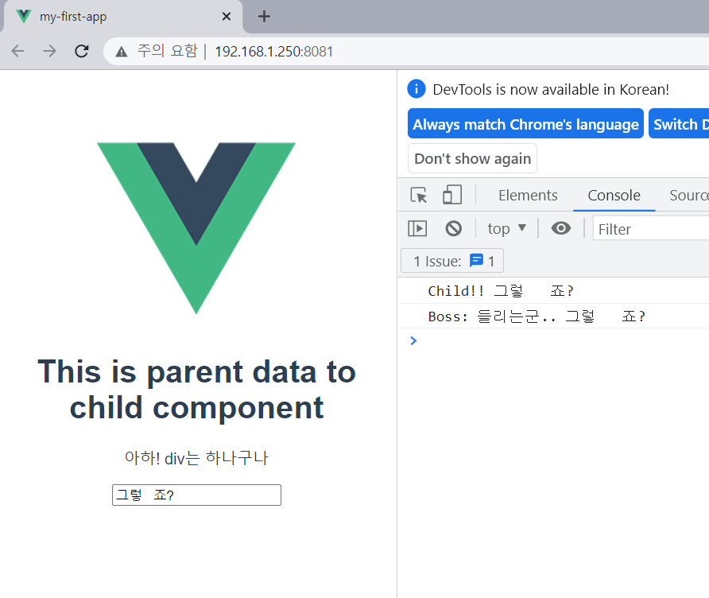

# 1. 이 프젝의 구조 + overview

```
App.vue
|
|..... TheAbout.vue
```



App 에서 `This is parent ~ ` 문구를 만들어서 TheAbout 컴포넌트로 prop하고 있고

TheAbout 의 input 태그 안에 데이터를 작성하면 emit으로 올려보내서 콘솔에 나오도록 하고 있는 구조

<br>

# 2. 상세 로직

## prop `App.vue ` to `TheAbout.vue`

1. App.vue에서 data() 부분에 prop을 보낼 데이터를 객체형태로 지정해줌

2. 그렇게 하고 template태그 내에 바인딩`:`  한 다음 Theabout 컴포넌트에서 받을 키워드를 생성하고, 데이터를 할당

   ##### (이때 키워드 명과 데이터 타입은 이름이 꼭 동일해야돼 아니면 웹상으로 안 보여짐)

3. ThrAbout 으로 넘어가서 일단 냅다 name부분에 컴포넌트 이름을 꼭 써줘야됨 (로직이 동작하는 필수요소)

4. 그리고 그 밑에 props 열어서 `받은 키워드 명: 데이터 타입` 으로 지정을 미리 해주고 

5. template 태그에서 변수 형식으로 data의 키워드를 넣어주면 됨

<br>

## emit `TheAbout.vue` to `App.vue`

1. data() 에 변수 하나 생성하기

   ```
   emitData : '내용을 쓰든지 빈칸으로 채우든지 해도됨'

2. input 태그 생성

   ```
   <input type="text" v-model="emitData" @keyup.enter="emitFunction">
   ```

   `v-model` = input 태그에 작성한 내용과 data를 동기화시키는 수단

   `@이벤트명`= 이벤트가 일어나면 특정 함수를 실핼시키는 기능

3. method에다가 함수 하나 만들고 이벤트가 일어날 때 실행할 함수(여기서는 emit동작을 하게 될 함수겠지)를 하나 만들어야됨

4. [참고](https://leestrument.tistory.com/entry/%EC%9E%90%EC%8B%9D%EA%B3%BC-%EB%B6%80%EB%AA%A8%EC%9D%98-%EB%8C%80%ED%99%94) 에밋을 시키고 App.vue로 넘어가서 하위 컴포넌트 태그에다가 받아온 에밋을 듣도록 @를 사용해서 하위 컴포넌트에서 사용한 키워드를 받아오고, 받아오면 실행할 함수를 작성해놓는다

5. 그리고 그 함수를 작성해야됨: methods 내에 작성 => 여기서는 에밋으로 받아온 데이터를 웹으로 출력할거니까 현재 컴포넌트에 등록된 변수에 데이터를 덮어씌우던지 아니면 에밋용 변수를 만들어서 새로 할당하고 뿌리든지 그건 알아서하셈
