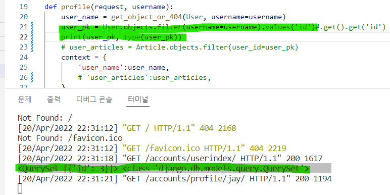

# mysns/ 0420 일지

## 1. 유저모델 생성 + 유저 목록, 프로필페이지 생성

나중에 README에 자세히 쓸거긴 할건데 좀 간단하게 말해보자면 나는 지금 유저가 쓴 게시글을 한 공간 안에 모으고 싶은게 아니라 

본인이 쓴 글은 본인의 프로필페이지에서만 보이도록 하는 로직을 구현하고 싶었다. 따라서 앱을 accounts 하나만 만들었고, 모든 로직이 저 앱 하나 안에서 굴러가도록 지정했다. 

그래서 사실 구현이 더 쉬워진 부분도 있다. 이를테면 auth_user_model을 settings에 따로 지정 안해도 된다거나 등등

그래서 아무튼 프로필 페이지에는 내가 쓴 글만 보이도록 만들거고

나중에 팔로우 기능을 추가할때 쯤, 내가 팔로우한 유저의 게시글도 볼 수 있도록 그 페이지는 따로 만들려고 하고 있다. 

그야말로 인스타처럼 구조를 만들어보려고 하는 중

이번에는 UI도 예쁘게 구성해보려고 한다 ~~ 정말 설렌다

## 2. 회원가입 기능 추가

## 3. 로그인 + 로그아웃 기능 추가

## 4. 모델 변경 : 게시글 + 코멘트 모델 추가

## 5. 게시글 작성기능 + 프로필 페이지에 게시하는 로직 추가

여기서 이제 내가 좀 헤맸던 부분이 있는데 

게시글을 작성하기까지는 수월했는데 작성자의 프로필 페이지에만 게시글을 보여주도록 하려니까 너무 힘든거임

여기서 역참조를 해야되나 ??? 이거는 공부를 좀 더 하고 다시 코드를 고쳐야겠다

아무튼 지금 작성한 코드는 이렇게 만들었는데

```python
def profile(request, username):
    user_name = get_object_or_404(User, username=username)
    user_pk = User.objects.filter(username=username).values('id').get().get('id')
    user_articles = Article.objects.filter(user_id=user_pk)
    context = {
        'user_name':user_name,
        'user_articles':user_articles,
    }
    return render(request, 'accounts/profile.html', context)
```

`user_articles` 변수가 지금 해당 유저가 쓴 글을 가져오는 건데 쿼리문을 좀 복잡하게 썼음 ..

일단 article 테이블에 작성자가 user_id => 숫자로 데이터가 쌓이길래 그 숫자를 가져오면 된다 생각해서  


이제 여기서부터 꼬리를 물고 생각 .. 얘를 어떻게 받아올까

그래서 생각한게 user_pk를 새로 변수로 만들어야되겠다는 생각

그래서 user_pk를 만들었고 username을 마침 베리어블라우팅으로 받아오고 있으니까 User모델에서 filter를 걸어서 username의 id를 value 값으로 받아왔다

그런데 이렇게 하니까 데이터타입이 쿼리셋으로 받아와짐 ..



그래서 뒤에 get()을 하나 붙였는데? 데이터타입이 그제서야 딕셔너리로 변환됨 ..


거기서 get을 하나 더 붙이는데 이제는 id key에 대한 value를 받아오려니까 `get('id')`를 쓰게됨 ..


그래서? 아주 길고 이상한 코드를 만들게되었다

결과사진 *^^*


왠지 다시생각해보니까 이거 역참조를 써야될것 같음 ..

공부하고 다시 코드 짜보자 ㅠㅠ .. ... ㅠㅠ . ㅠ ..