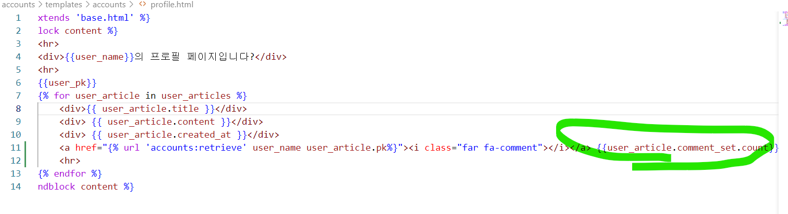

# mysns/ 0421 일지

## 6. 디테일페이지 추가

인스타그램을 보니까 여기도 디테일페이지가 있고 거기에 댓글을 쓰도록 만들어놨더라고요 ...

그래서 일단 나도 디테일페이지를 냅다 만들었음

궁금한게 있는데 다른페이지를 로드할때 페이지 보여지는 형태를 모달폼으로 할수있나 ??

인스타에서 그렇게 하길래 장고로만도 할수있는지 뭔가 서치를 해봤는데 음 .. 못하는것같기도 ...

얼른 자바스크립트 배워서 프론트도 예쁘게 만들어보고싶다

+) 디테일페이지에 인스타처럼 댓글 아이콘을 달고 아이콘 클릭하면 디테일페이지로 가도록 만들었음 ㅎㅎ 그리고 다음번에는 댓글폼에다가 그 포커스 맞추는 설정을 적용해봐야겠다

무려 "역참조"를 사용함 ..... 

아 맞다 그 어제 고민했던 기능은 역참조로 할 수 없었던 것이었다 좀만 생각하면 알 수 있었음

근데 그러면 그 코드가 과연 최선일까 ..?

그건 모르겠다. 

좀더 생각해보기

 

## 7. 댓글 생성기능 + 댓글 노출로직 추가

댓글로직 만들때 시간이 조금 걸렸다 .. redirect할때 값을 넘겨줘야되는데 그걸안해서 바보같이 시간을 끌고있었음

