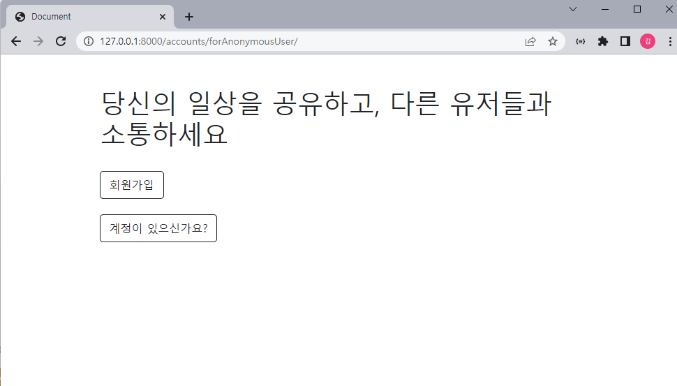
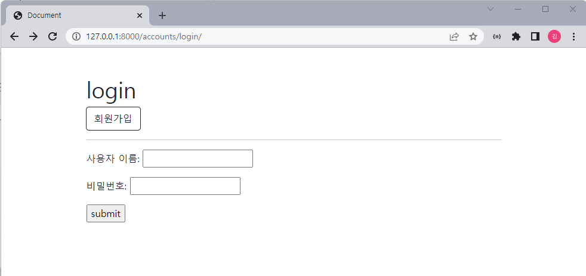

# mysns/ 0424 일지

## 8. 로그인 안 했을때 사이트 소개 페이지 노출 로직 추가

그냥 흔한 문구를 넣어보았다 ..

## 9. 페이지 몇개 수정 + 로그인 안하면 사이트 접근 불가하게 하는 로직 추가

이런식으로 로그인페이지랑 회원가입페이지는 navbar 노출 안되고 회원가입버튼 or 로그인버튼만 나오도록 구성함

## 10. view 함수 분리

함수가 길어지는것같아서 두개로 분리하려고 하고 있음

 `index_to_comment.py` 

\# 로그인 안했을때 사이트 소개 페이지

\# 유저목록 보여주는 페이지 (이후 팔로우기능 추가되면 바뀔예정)

\# 개인계정 페이지 로드

\# 회원가입 페이지 로드

\# 로그인 페이지 로드

\# 로그아웃

\# 게시글 작성 페이지 로드

\# 게시글 디테일 페이지 로드

\# 댓글 작성 로직

`like_to_follows.py`

좋아요 기능

팔로우 기능

또 뭐있을가?

좀 더 생각해보기 ..

