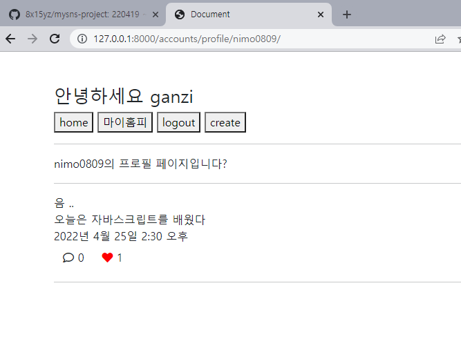
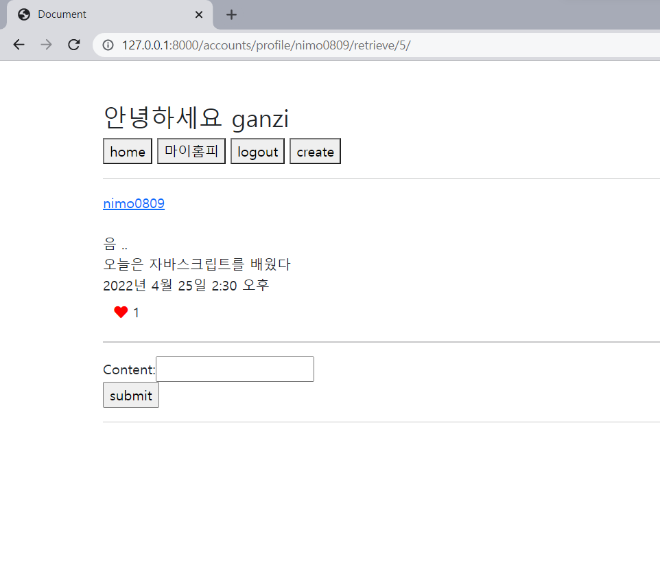
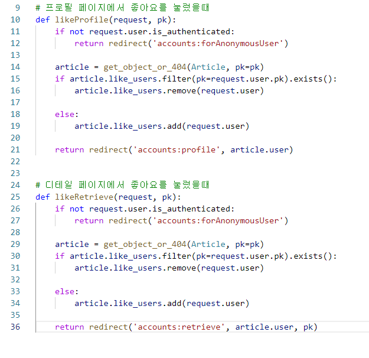

# mysns/ 0425 일지

## 11. 좋아요 기능 추가

코드중복이 발생했다 ..? ^^

프로필 페이지에서 좋아요를 누를때와 디테일 페이지에서 좋아요를 누를때 

로직은 당연히 같은데 redirecrt 하는 곳만 달라서 함수를 그냥 나눴다

아니 if 문 써서 리턴을 분기해보고도 싶었는데

역시 내 역량부족이다. ... if문에 어떤 조건을 넣어야 될 지 모르겠다. 

request에서 어떻게 받아올 수 없을까 ..?

내가 필요했던 데이터는: 어느 페이지에서 요청했는지의 주소(url)

이거를 그러면 그때 배운 next로 할 수 있을까 ?

사실 시도해봤다가 어떻게 풀어나가야되는지를 모르겠어서 금방 포기하긴 함 ..

request.GET.get('next') 타입을 보니까 none이던데 ㅠㅠㅠㅠㅠㅠ 이거 뭔가요 ㅜㅠㅠ

나중에 좀 더 생각해보자 

고작 리턴 때문에 함수를 두개로 만들어버린게 오늘의 아쉬운 점이다. ....
