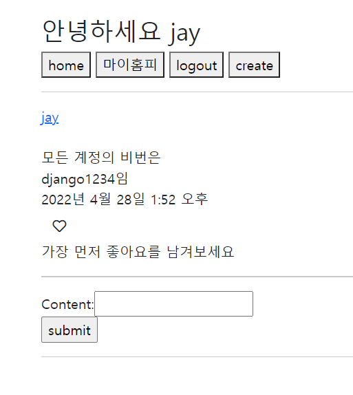
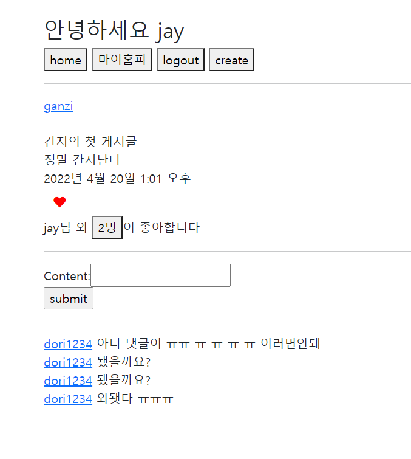
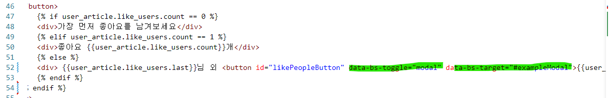
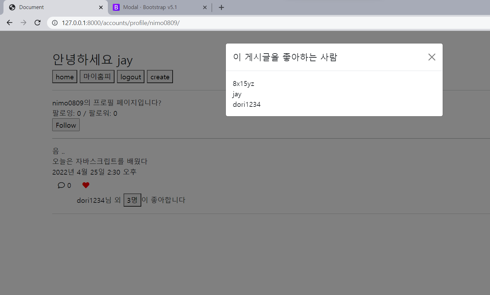
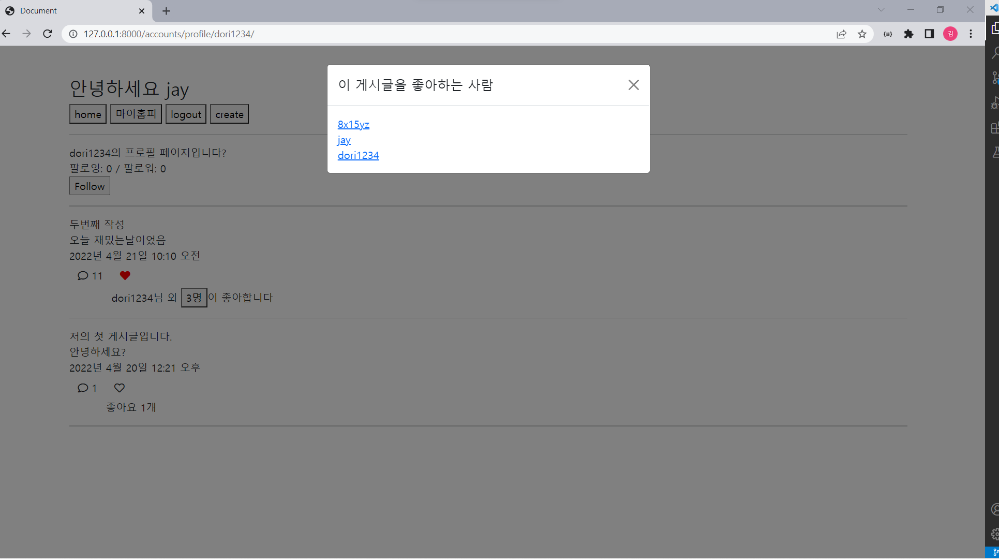

# mysns/ 0504 일지

## 13. 좋아요 세부기능 추가

좋아요 갯수에 따라서 문구가 달라짐:

좋아요가 0개면 `가장 먼저 좋아요를 남겨보세요`

1개면 `좋아요 1개`

2개 이상이면 `{최근에 누른 사용자}님 외 {좋아요 누른 사용자 수}명이 좋아합니다` 출력

[이때 이거를 보고 코드를 작성](http://pythonstudy.xyz/python/article/310-Django-%EB%AA%A8%EB%8D%B8-API)

최근에 누른 사용자 -> orm으로 게시글에 좋아요 누른 사람 받아오고 거기서 last 쿼리 메서드를 적용하였음

## 14. 좋아요 누른 사람들 목록 modal form으로 보여주기

1. 이제  `{좋아요 누른 사용자 수}명` 이 부분을 버튼으로 바꿔서 이거를 누르면 모달폼이 나타나게 하고 싶었는데 이 코드들이 form 안에 있어서 버튼을 눌러도 post 동작을 무시하도록 js로 기능을 줘야됨
2. 그래서 script 태그를 열고 그 안에다가 event.preventDefault()를 적용하였음

그렇게 하고 일단은 부트스트랩을 빌려서 모달폼을 적용해보았음: 모달폼 나중에 내가 만들고 싶은 대로 만들거라서 나중에는 css로만 만들어볼 예정

3. 부트스트랩 적용

모달 버튼에 `data-bs-toggle="modal"`  `data-bs-target="#exampleModal"` 추가하고 

모달 코드 끌어와서 

게시글을 좋아하는 유저 쿼리셋으로 들고오고 그거를 for문을 돌려서 하나씩 출력하도록 함 -> 모달창 내용

 

결과:

완성하였다 ~~ .. 졸려 

자자

+) 모달폼에 나온 유저들을 다 그 저기 링크를 걸어서 그 유저의 퍼스널 페이지로 이동도 할 수 있도록  함

