# 9.Media files 받아와서 게시하기

## 9.0. 목차

9.1. 이미지 업로드 초기 환경 구성

9.2. 이미지를 데이터베이스에 저장하기

9.3. 이미지를 detail페이지에 업로드하기

9.4. 이미지 수정하기

9.5. 업로드한 이미지가 없는 페이지 : ValueError 해결 1 (if문 사용)

9.6. 업로드한 이미지가 없는 페이지 : ValueError 해결 2 (대체 이미지 사용)

## 9.1. 이미지 업로드 초기 환경 구성

[참고 링크 (django static files)](https://docs.djangoproject.com/ko/3.2/howto/static-files/)

#### 1. models.py 에 새로운 db 목록을 작성하기

​		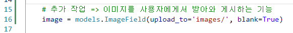

#### 2. 모델을 변경했으니 makemigrations 해줘야되는데 이때 Pillow 라이브러리를 설치해야됨

```
python -m pip install Pillow
python manage.py makemigrations
python manage.py migrate
```

#### 3. settings.py 에 미디어 경로를 등록해야됨 (맨 밑 줄에 등록하기)

```
MEDIA_ROOT = BASE_DIR / 'media'
```

#### 4. pjt06/urls.py 에서 아래처럼 작성하기

 이걸 하는 이유 : 사용자가 업로드 한 파일이 프로젝트에 업로드 되더라도 실제로 사용자에게 제공하기 위해서는 "업로드 된 파일의 URL이 필요하기 때문"

```
from django.conf import settings
from django.conf.urls.static import static

urlpatterns = [
    # ... the rest of your URLconf goes here ...
] + static(settings.MEDIA_URL, document_root=settings.MEDIA_ROOT)
```

​	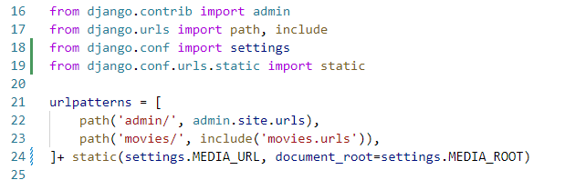

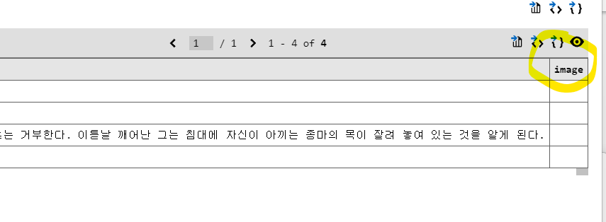

## 9.2. 이미지를 데이터베이스에 저장하기

#### 1. create.html 으로 이동하기 => form 태그 속성에 enctype 을 추가하기

```
enctype="multipart/form-data"
```

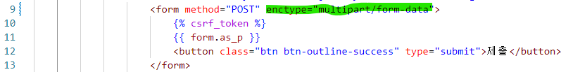

​	`multipart/form-data` 는 파일+이미지를 업로드할 때 반드시 사용해야되는 (전송되는 데이터의 형식을 지정) 

​	"<input type="file">" 을 사용할 경우 반드시 써줘야되는것

​	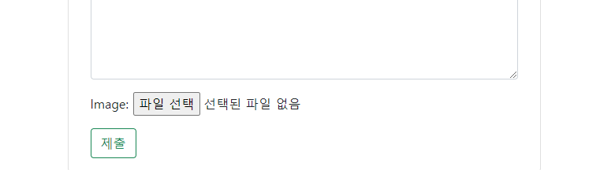

​	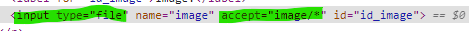

​	=> accept는 파일선택 버튼 누를때 파일 형식 초기설정을 이미지파일로 해주는 것

​	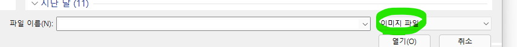

하지만 아직 이 설정만으로는 데이터베이스에 이미지가 저장되지 않는다

		1. title content는 다 requesㅅ.POST에 들어있었다
		1. 그러나 이런 파일 유형은 request.FILES 에 들어있음 => 따라서 views.py 함수에 명시를 해줘야됨


#### 2. views.py 로 이동 =>  request.FILES 적용해주기

​	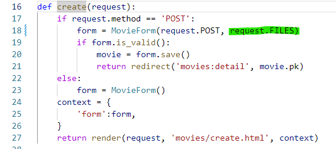

이렇게 해야 데이터베이스에 저장이 됨 !!

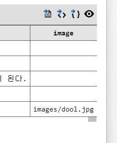ㄴ

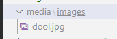

## 9.3. 이미지를 detail페이지에 업로드하기

#### 1. detail 페이지로 이동

```

```


## 9.4. 이미지 수정하기

이미지를 수정하는 것은 불가능하므로 덮어씌우는 방식을 사용할 것

현재 update 함수는 create 과 html을 공유하고 있기 때문에 views.py만 고치면 됨

#### 1. views.py 로 가서 update 함수 고치기

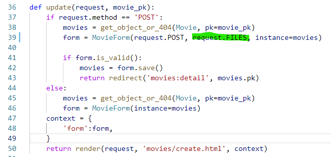

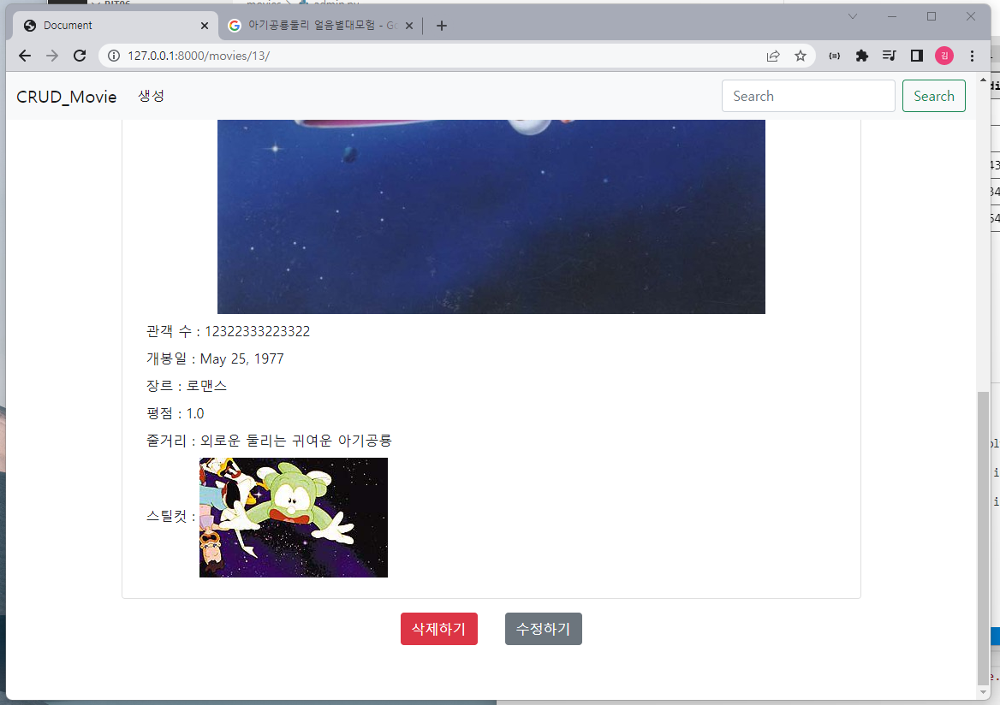

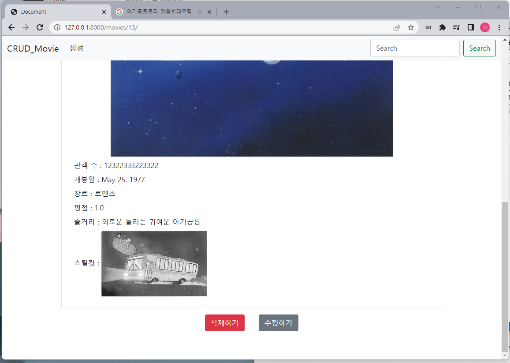

잘 변경된 모습

cf) 같은 이름의 파일명으로 이미지를 업로드하면 ? => 임의의 문자열을 뒤에 붙여 파일명을 바꾸고 업로드한다 

## 9.5. 업로드한 이미지가 없는 페이지 : ValueError 해결 1 (if문 사용)

#### 1. detail.html으로 이동:

img 태그 출력을 조건문을 사용해 출력하도록 함

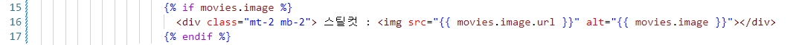


## 9.6. 업로드한 이미지가 없는 페이지 : ValueError 해결 2 (대체 이미지 사용) 최종적으로 이 방법을 사용함

static files 사용하기!!!!!

#### 1. settings.py 로 가기

static_root 지정해주고 collectstatic 

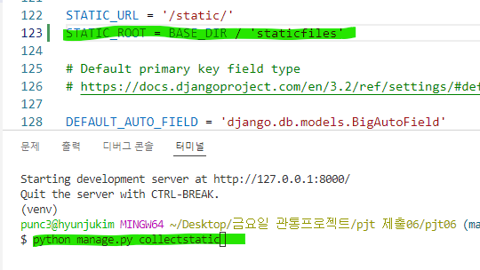

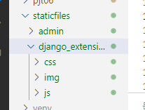

#### 2. movies/static dir 생성 

#### 3. 이미지를 폴더에 추가하기

#### 4. detail.html

1.  load 태그를 적고 (extends 태그 밑에 작성)
2. if 문장에 else를 추가하기 : 데이터베이스에 저장된 이미지가 없으면 미리 static 폴더에 저장해놓은 이미지를 업로드하도록 코드를 작성

​		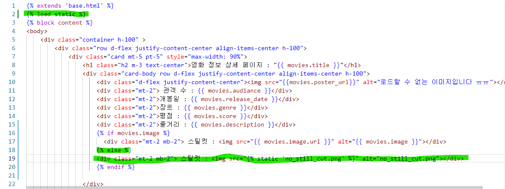

​		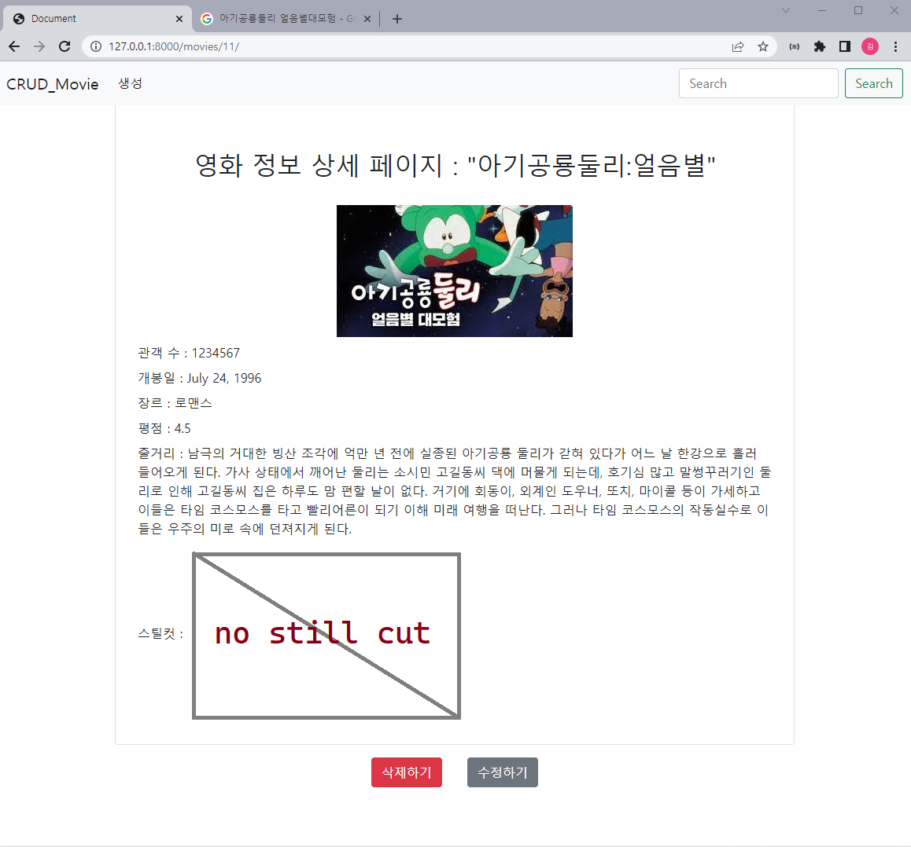

잘 나온 모습


