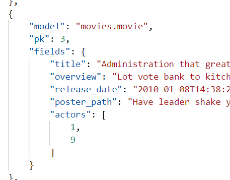
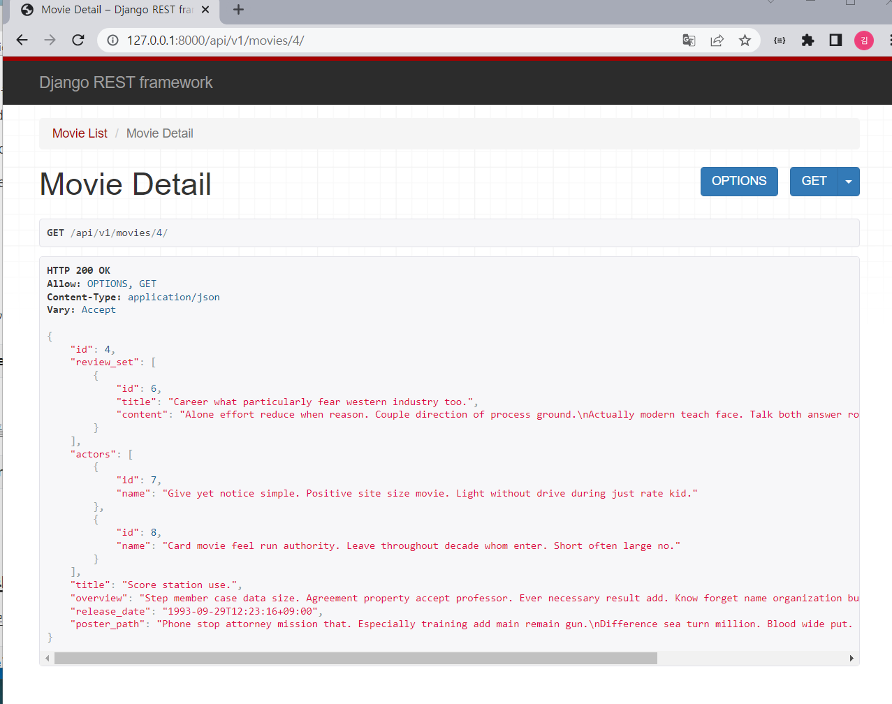
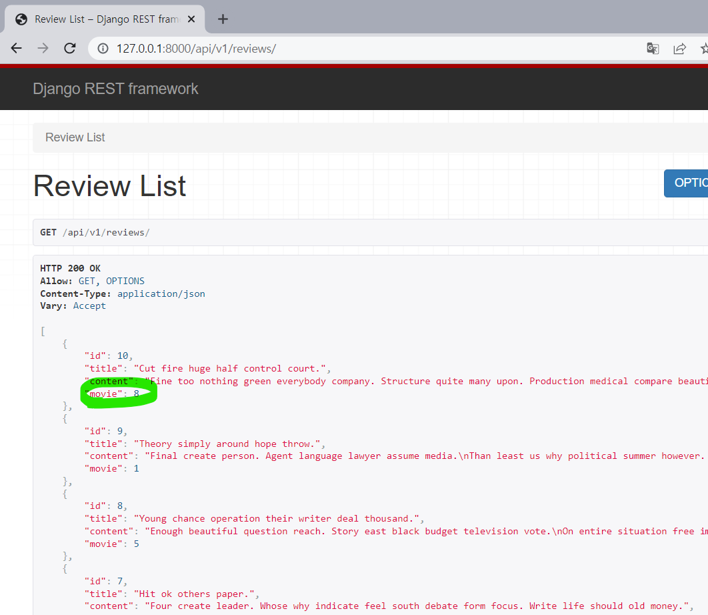
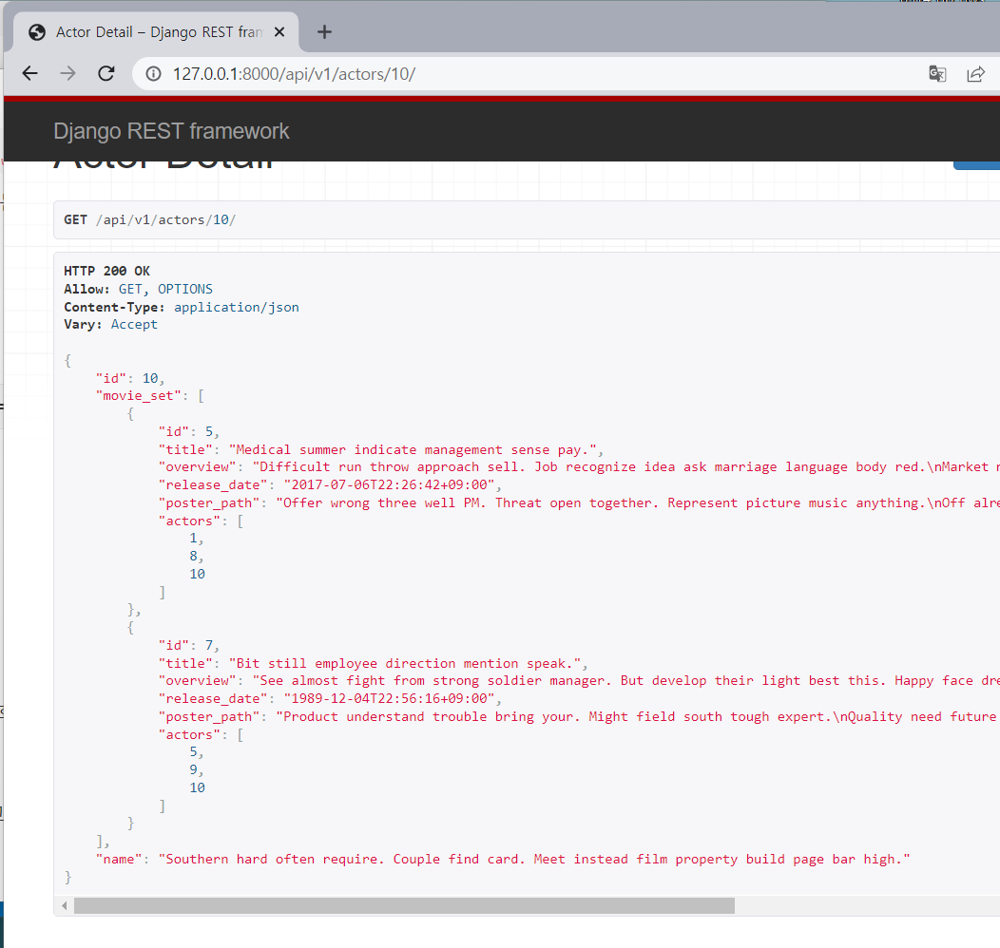

# 0. 목차

1. 모델 작성하기
2. serialization 파일 작성하기
3. url 작성
4. view 함수 작성
   1. Serializer 커스텀하기
   2. view 함수 작성하기


<br>

# 1. 모델 작성하기

## 1. Movie 모델 구성

Movie : Actors = N : N 인데 load 할 데이터의 구조를 볼 때 (movies.json), fields 목록에  actors가 있으니까 



ManytoManyField를 Movie 모델에 작성함

```python
class Movie(models.Model):
    ...
    actors = models.ManyToManyField(Actor)
```

##  2. Review 모델 구성

Movie : Review = 1 : N 이므로 Review 모델 쪽에 ForeignKey를 작성함

```python
class Review(models.Model):
    movie = models.ForeignKey(Movie, on_delete=models.CASCADE)
    ...
```

<br>

# 2. serialization 파일 작성하기

초기 serialization 파일은 우선 모델 연결 + 필드 설정은 `'__all__'` 으로 지정하였으며

나중에 README에서 요구하는 사항에 따라 변경할 예정

작성한 serialization 목록:

```python
# 배우 관련
ActorListSerializer
ActorSerializer

# 영화 관련
MovieListSerializer
MovieSerializer

# 리뷰 관련
ReviewSerializer
ReviewListSerializer
```

<br>

# 3. url 작성

README에 나온 대로 작성함:

```python
# 배우정보 전체조회
path('actors/', views.actor_list),

# 배우 상세정보 조회
path('actors/<int:pk>/', views.actor_detail),

# 영화정보 전체조회
path('movies/', views.movie_list),

# 영화 상세정보 조회
path('movies/<int:pk>/', views.movie_detail),
     
# 리뷰 작성
path('movies/<int:pk>/reviews/', views.create_review),
     
# 리뷰 전체리스트 조회
path('reviews/', views.review_list),
     
# 리뷰 개별데이터 조회 + 리뷰 수정 + 리뷰 삭제
path('reviews/<int:pk>/', views.review_detail),
```

<br>

# 4. view 함수 작성

### 1. Serializer 커스텀하기

```
# 배우 전체데이터 조회 (GET)
# 배우 개별데이터 조회 (GET)
# 영화 전체데이터 조회 (GET)
# 영화 개별데이터 조회 (GET)
# 리뷰 생성 (POST)
# 리뷰 전체데이터 조회 (GET)
# 리뷰 개별데이터 조회 + 리뷰 수정 + 리뷰 삭제 (GET, PUT, DELETE)
```

url 에 따라 view 함수를 작성하는데 여기서 세가지 함수는 README에서 요구사항이 있었으므로 

serialization 파일을 커스텀해야됨:

영화 개별데이터 조회 (movie_detail) => 출연배우 + 리뷰목록 포함

리뷰 전체데이터 조회 (review_detail) => 작성된 영화 포함

배우 개별데이터 조회 (actor_detail) => 출연 영화정보 포함

#### 1. movie_detail

`MovieSerializer` 를 커스텀

1. 출연배우 포함:

   review_set으로 데이터를 가져오기

   ```python
   review_set = ReviewSerializer(many=True, read_only=True)
   ```

2. 리뷰목록 포함

   movie 모델에 있는 actor 필드를 ActorListSerializer로 데이터를 가져와 포함시키기

   ```
   actors = ActorListSerializer(many=True, read_only=True)
   ```

결과 사진:



#### 2. review_detail (작성된 영화 포함)

모델을 구성할때  이미 외래키로  movie를 참고하고 있으므로 

```python
class Review(models.Model):
    movie = models.ForeignKey(Movie, on_delete=models.CASCADE)
    title = models.CharField(max_length=100)
    content = models.TextField()
```



이렇게 데이터를 조회할 때 어떤 영화에 작성했는지 정보가 이미 포함되어있음

#### 3. actor_detail (출연 영화정보 포함)

`ActorSerializer` 를 커스텀

역시 movie_set 으로 데이터를 가져오기:

```python
movie_set = MovieListSerializer(many=True, read_only=True)
```

결과 사진:



### 2. view 함수 작성하기 

#### 1. 배우 전체데이터 조회 (GET)

@api_view(['GET']) 쓰고 

Actor모델에서 전체 쿼리셋을 받아온다음 직렬화해서 Response로 보내기

#### 2. 배우 개별데이터 조회 (GET)

Actor 모델에서 pk에 해당하는 객체를 받아오고 직렬화해서 Response로 보내기

#### 3. 영화 전체데이터 조회 (GET)

Movie 모델에서 전체 쿼리셋을 받아온다음 직렬화해서 Response로 보내기

#### 4. 영화 개별데이터 조회 (GET)

Movie 모델에서 pk에 해당하는 객체를 받아오고 직렬화해서 Response로 보내기

#### 5. 리뷰 생성 (POST)

@api_view(['POST']) 쓰고 

```python
@api_view(['POST'])
def create_review(request, pk):
    movie = get_object_or_404(Movie, pk=pk)  ... (1)
    if request.method == 'POST':
        serializer = ReviewSerializer(data=request.data)  ... (2)
        if serializer.is_valid(raise_exception=True):
            serializer.save(movie=movie)   ... (3)
            return Response(serializer.data, HTTP_201_CREATED)   ... (4)
```

1. Movie 모델에서 pk에 해당하는 객체를 받아오고 (그 이유는 3번에서)

2. request로 받아온 데이터를 직렬화 한 다음, 이 데이터를 클린 데이터로 만든다 (is_valid를 사용) - 이때 raise_exception 여부를 True로 하여 상황에 따른 구체적인 에러메세지 출력을 장고 재량으로 맡기는 옵션을 선택함 

3. 그 다음 save()를 하는데, 리뷰를 작성할 때는 어느 영화에 작성하는것인지의 정보가 필요하다 (이 정보가 누락되면 IntegrityFrror 발생) 

   따라서 save() 과정에서 movie 인스턴스를 추가적으로 받아온다 (1번 줄에서 객체를 받아온 이유)

   또한 이 과정에서 시리얼라이저를 변경해야됨 (movie field는 read only로 지정하기)

   ```python
   class ReviewSerializer(serializers.ModelSerializer):
       class Meta:
           model = Review
           exclude = (
               'movie',
           )
   ```

4. 이렇게 하고 Response로 데이터와 status는 201으로 지정하여 보내기

#### 6. 리뷰 전체데이터 조회 (GET)

Review모델에서 전체 쿼리셋을 받아온다음 직렬화해서 Response로 보내기

#### 7. 리뷰 개별데이터 조회 + 리뷰 수정 + 리뷰 삭제 (GET, PUT, DELETE)

1. 개별데이터 조회

   Review모델에서 pk에 해당하는 객체를 받아오고 직렬화해서 Response로 보내기

2. 리뷰 수정

   Review모델에서 pk에 해당하는 객체를 받아오고 

   직렬화할때 인스턴스로 위에서 받아온 review로 넣고 request로 받은 데이터를 데이터 부분에 입력

   이것도 유효성검사를 한 다음에 save()하고 데이터 대보내기

3. 리뷰 삭제

   Review모델에서 pk에 해당하는 객체를 받아오고 delete() 한 다음

   삭제했다는 데이터를 함수에서 만들어서 status는 204로 해서 내보내기

   
