# 1:N DB 관계 오후강의 코드

##### 그니까 오늘 강의의 핵심은 1:N 인 건데 `세가지 1:N` 을 만든거임

```
1. Article : Comment = 1 : N
2. User : Article = 1 : N
3. User : Comment = 1 : N
```

## 0. 목차

1. Subtituting a custom User model
   1. 내장 모델을 상속
   2. Custom User model 정의
2. Custom user & Built in auth forms => UserCreationForm 커스텀
3. 새로 바뀐 모델에서의 1:N (User : Article = 1 : N)
   1. forgin key 발급
   2. 게시글 생성 페이지에서 User 없애주기 (Create)
   3. 1:N 에서의 게시글 delete + update작업
   4. 게시글에 작성한user 명시
   5. delete + update 버튼 => 작성자에게만 보이도록 하기
4. 새로 바뀐 모델에서의 1:N (User : Comment = 1 : N)

## 1. Subtituting a custom User model "Highly recommended"

### 1. 유저 모델을 사용하려면 `AbstractUser` 내장 모델을 상속받아서 사용하기

정말 중요합니다. ... 이거는 migrate하기 전부터 이거는 꼭해줘야되는 부분이다.   그냥 이제 프젝 만들기 시작할때 User 모델이 필요하다 ? 이걸 그냥 제일 먼저 해야되는 부분임

```
과정이 두단계 있음:
1. accounts/ models.py custom User Model을 정의하고 
2. config/ settings.py 에다가 `대체` 
```

accounts/ models/py

```
from django.db import models
from django.contrib.auth.models import AbstractBaseUser

class User(AbstractBaseUser):
    pass
```

config/ settings.py

맨 밑줄에다 이 코드 추가해주기

```
AUTH_USER_MODEL = 'accounts.User'
```


### 2. 데이터베이스 초기화하기 + 새롭게 migration 작업을 해주기

프로젝트를 중간에 징행했기 때문에 db를 초기화 한 후 migration  진행해야됨

1. db.sqlite 파일 삭제
2. migrations dir 내 파일 모두 삭제 (파일명에 숫자가 붙은 파일만 삭제하기) (설계도를 지우란 소리)
3. 그렇게 한 다음 다시 makemigrations + migrate

###### 이렇게 해주는 이유는 지금 User 모델을 내장모델(AbstractUser)을 가져와서 내맘대로 새롭게 커스텀하기 위함임


### 3. ㅍ해주기

accounts/ admin.py 에다가 custom User 등록하기

```
from django.contrib.auth.admin import UserAdmin
from .models import User

admin.site.register(User, UserAdmin)
```

db 다 날렸으니까 cratesuperuser도 같이 해줘야됨

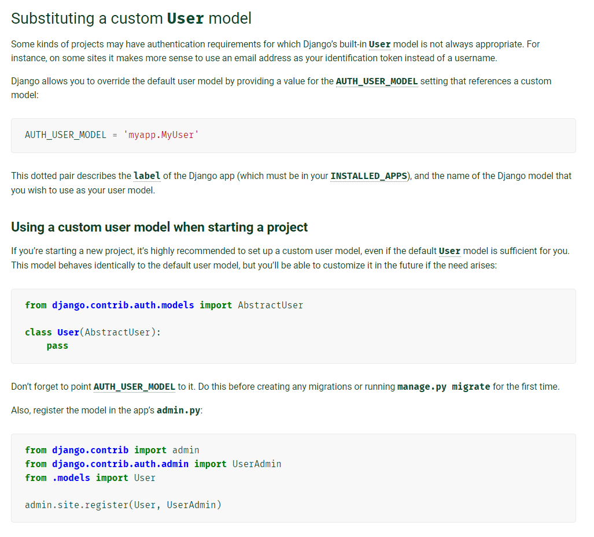

요거를 잘 따르자. 


## 2. Custom user & Built in auth forms

지금 이제 빌트인 폼을 사용했던 것들이 좀 어긋날것임 왜냐면 이전까지는 내장모델을 써왔는데 커스텀한답시고 새로운 모델을 만들어버였으니까 그거에 대한 조정을 좀 적용해줘야되는 작업

두가지에 대해 커스텀을 적용해주면 됨

1. UserCreationForm
2. UserChangeForm

### 1. UserCreationForm 커스텀하기

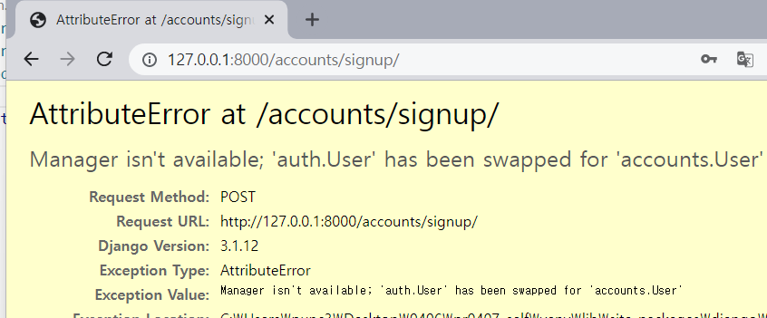

에러설명: auth.user 가 accounts_User 으로 바귀었다는 대충 그런 뜻 => 이제 UserCreationForm 도  불러와가지고 커스텀을 적용해줘야 된다는 뜻이다 .

get_user_model은 `현재 활성화된 유저모델`을 리턴하기 때문에 

accounts/ forms.py에서  

```
class CustomUserCreationForm(UserCreationForm):
    class Meta(UserCreationForm.Meta):
        model = get_user_model()
        fields = UserCreationForm.Meta.fields + ('email',)
```

이 코드를 추가해주고 views.py에서 모델을 다 커스텀으로 바꿔주자


### 2. UserChangeForm 은 이미 바꿨기 때문에 pass


## 3. 새로 바뀐 모델에서의 1:N (User : Article = 1 : N)

### 1. forgin key 발급

articles/ model.py

```
user = models.ForeignKey(settings.AUTH_USER_MODEL, on_delete=models.CASCADE)
```

<hr> cf) django에서 user model을 참조할 때:

1. models.py 에서는 `settings.AUTH_USER_MODEL` 사용 (str를 반환하기 때문)

2. 그 외의 곳에서는 `get_user_model()` (객체를 반환하기 때문)

<hr>

모델을 바꿨으니 migrations 해줘야됨

근데 makemigrations 하니까:

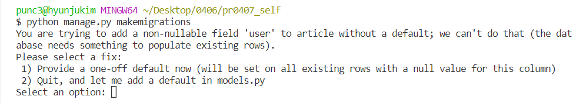

이게 뜨겠지

기존에 아티클이 있는데 여기에 왜래키가 추가되는거니까 빈칸들 데이터 어떻게 처리할지 물어보는 거니까

우리는 그래서 1번을 입력해줄거임 (장고 재량으로 하라는 뜻)

### 2. 게시글 생성 페이지에서 User 없애주기 (Create)

게시글 생성 페이지 가보니까 이렇게 돼있어:

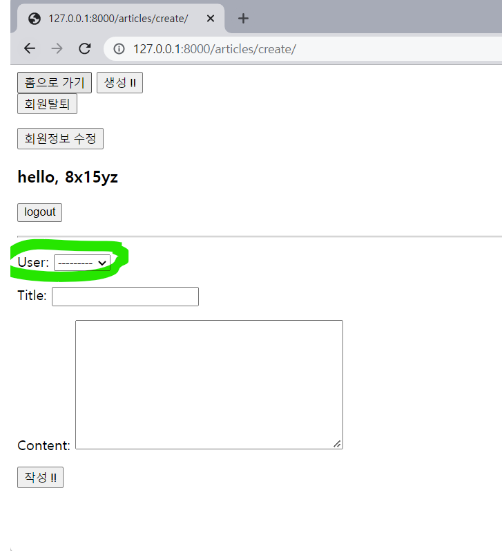

이거알지? 아까 댓글 만들때 봤던 거였어

또 forms.py + views.py 건들러 가야됨

1. articles/ forms.py

   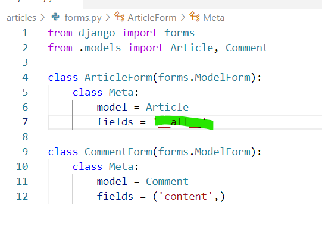

   이부분말이야

   지금 다 받고 있으니까 저거를 바꿔야된다는것임ㄴㅇ

   ```
   exclude = ('user',)
   ```

    이걸로 대체해주기

2. articles/ views.py

   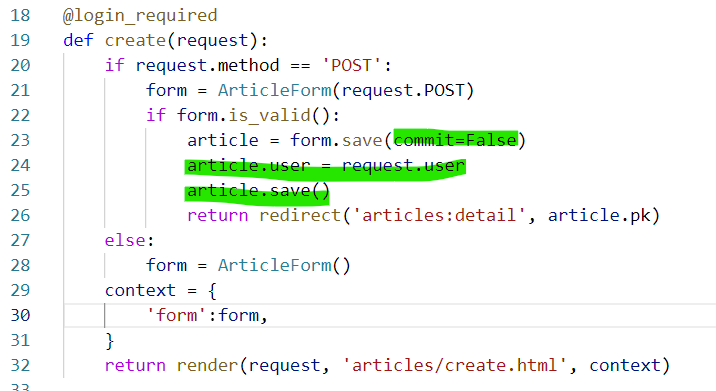

   여기도 이렇게 바꿔줘야되는거 RG   ?

<hr>이렇게 바꾸고 나면

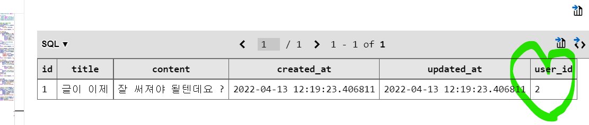

이렇게 어떤 계정이 썼는지도 값에 저장되는것을 볼 수 있음 !!!!!!!!!!!!!!!!!!!!!!!!!!!!!!!


### 3. 1:N 에서의 게시글 delete + update작업

##### 이제 어떤 회원이 어떤 게시글을 작성했는지 알수 있으니까 이 정보로 delete/ update에 제한을 둘 수 있음

articles/ views.py/ delete 함수 

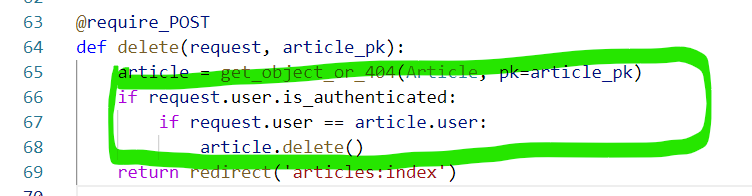

articles/ views.py/ update 함수 

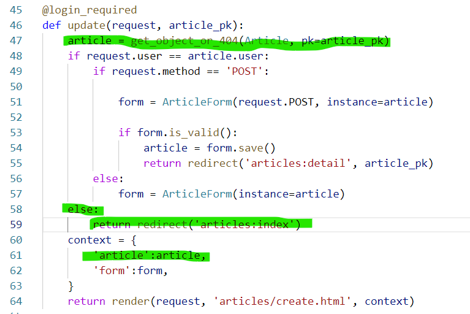

### 4. 게시글에 작성한user 명시해주는 작업

articles/ detail.html

```
<div>작성자: {{ article.user }}</div> 이거 추가해주긔
```

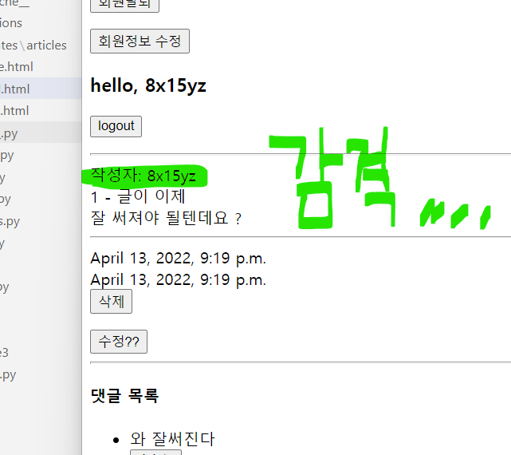

### 5. delete + update 버튼 => 작성자에게만 보이도록 하기

이게 물론 views.py에서부터 막아놓기는 했지만 그래도 보이는 부분을 숨기기는 해야되니까 

html파일에서 if 태그를 이용해 버튼 노출을 제한하도록 하기

articles/ detail.html

```
버튼부분 코드를 if로 감싸주기
```

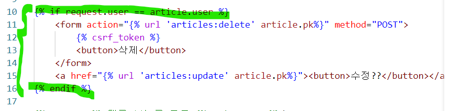

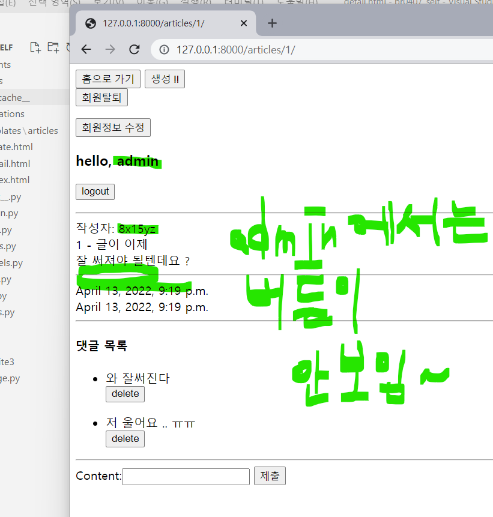


## 4. 새로 바뀐 모델에서의 1:N (User : Comment = 1 : N)

이거는 User : Article = 1 : N 일때랑 과정이 동일함 !!!

### 1. forgin key 발급

articles/ models.py / Comment

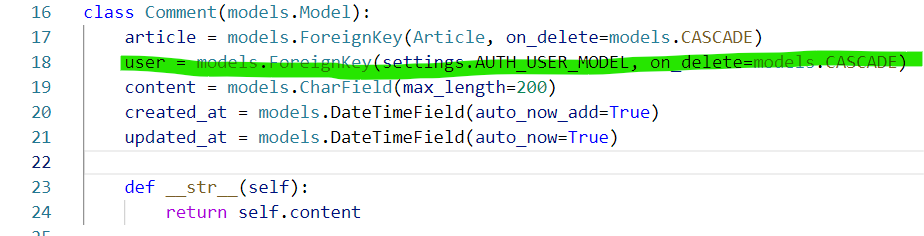

```
makemigrations + migrate
```

### 2. 댓글페이지에서 어떤 게시글에 댓글쓰는지 

그거 바꿔야되는데 이미 앞서 해줘서 안해도됨

### 여기서 댓글을 쓰면 당연히안됨:

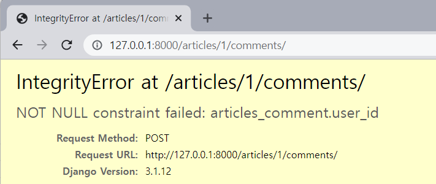

이 에러의 뜻은?:  외래키 지금 없다는뜻 => 댓글 누가 쓴건데 ???? 물어보고잇는것 !!! `user_id`가 짓금 안들어오고있다는 듯

### 3. 외래키 하나 더 더해주러 가기

articles/ views.py/ comment_create

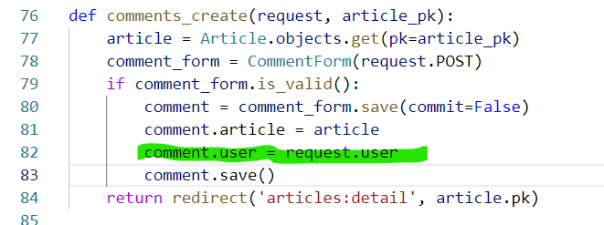

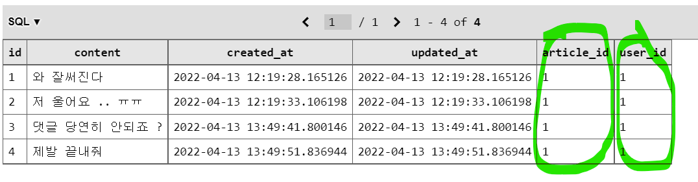

db에서 지금 1번 게시글에 1번 유저가 뎃글을 썼다는 뜻

맨 왼쪽에 id는 알지? 댓글 번호인것임

### 4. 댓글 작성/삭제버튼 노출 제한하기

articles/ templates/ articles/ detail.html

#### 1. 로그인해야 댓글 작성할 수 있도록

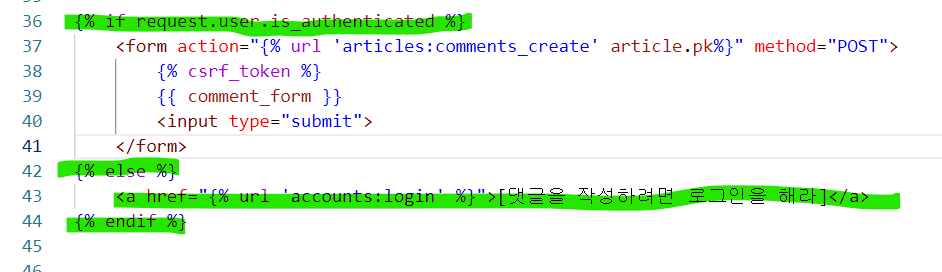

#### 2. 댓글 누가썻는지 표시


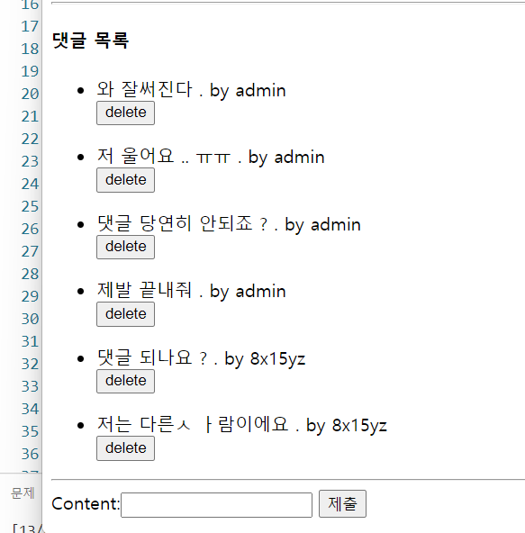

#### 3. 댓글 삭제버튼 작성자에 한해 제한

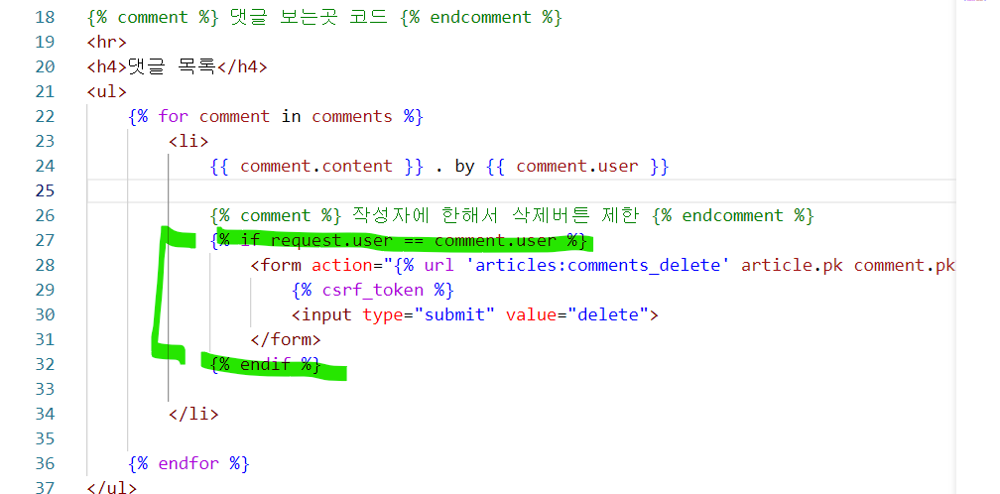

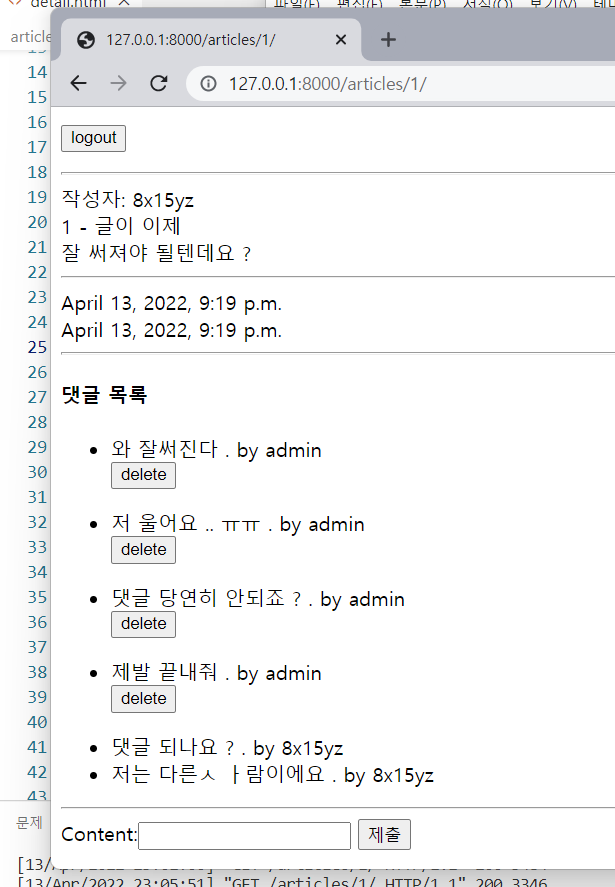

#### => 이거는 지금 껍데기 기능일 뿐

#### 3.1. views.py 로 완전히 작성자만 댓글을 삭제할 수 있도록 적용해주기

articles/ view.py/ comment_delete

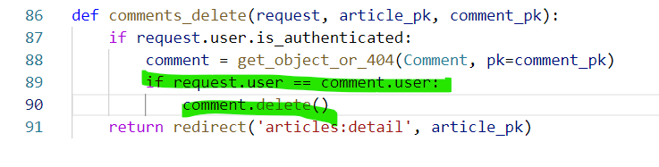

