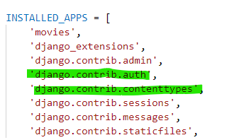
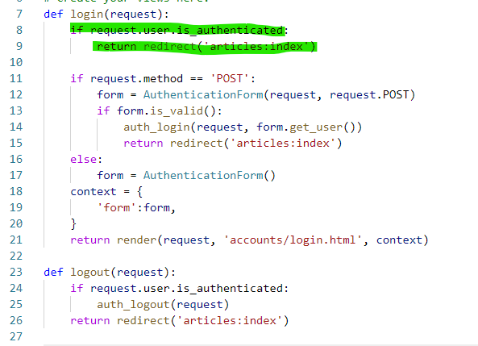
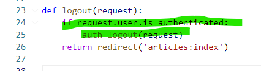
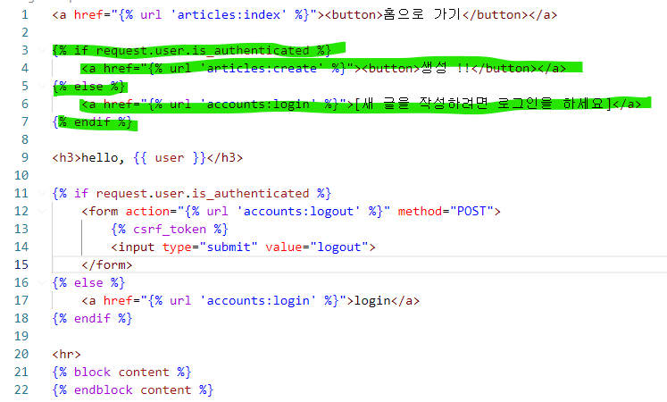
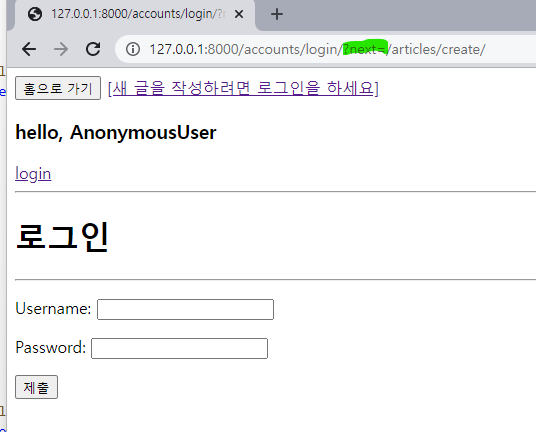
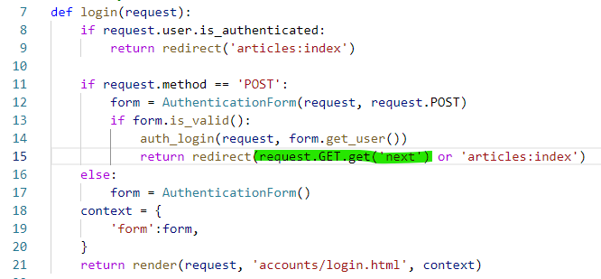
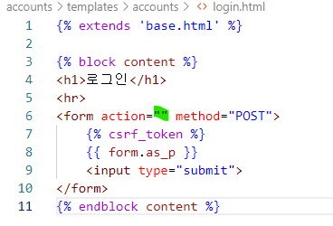

# Authentication System (0411 강의) 오전

## 0. 목차

1. 필수 구성은 이미 settings.py에 포함되어 있음
2. accounts 앱 하나 더 만들기 => 초기화
3. 로그인 폼 만들기 => AuthentiationForm (쿠키를 이용해 세션을 유지하는 방법)
4. 로그아웃 기능 만들기
5. 1.사용자에 대한 접근 제한
   1. base.html 만 바꿔보기
   2. views.py에서 함수를 바꾸기
   3. 인증된 사용자한테만 "게시글 작성 링크"를 볼 수 있도록 처리하기
   4. articles/views.py 수정하기
6. next 파라미터 다루기
6. delete 동작에서 로그인에 성공할시 405 오류 해결

## 1. 필수 구성은 이미 settings.py에 포함되어 있음



401 인증 Unauthorized 누군지도 몰라

403 권한 Forbidden 누군지 아는데 너는 권한이 없다

## 2. accounts 앱 하나 더 만들기 => 초기화

1. python manage.py startapp accouns
2. settings.py에 앱 등록하고 project 의 urls.py에 path를 등록하기
3. accounts  app에 urls.py 만들기 => 앱네임 써주고 urlpatterns 작성해주기

## 3. 로그인 폼 만들기 => AuthentiationForm (쿠키를 이용해 세션을 유지하는 방법)

1. accounts/ urls.py

   ```
   path('login/', views.login, name='login'),
   ```

2. accounts/ views.py

   ```
   1. from django.contrib.auth.forms import AuthenticationForm 모듈 작성
   2. login 함수 만들어서 if 분기 처리하고 else문부터 먼저 작성하기:
   	로그인 폼을 보여주는 코드를 만들것임
   3. 윗 분기에는 로그인 함수를 만들어줘야되니까 from django.contrib.auth import login as auth_login 모듈 불러오기 (이름 겹쳐가지고 이름 바꿀거임)
   ```

   ```
   # 완성 코드
   def login(request):
       if request.method == 'POST':
           form = AuthenticationForm(request, request.POST)
           if form.is_valid():
               auth_login(request, form.get_user())
               return redirect('articles:index')
   
       else:
           form = AuthenticationForm()
       context = {
           'form':form,
       }
       return render(request, 'accounts/login.html', context)
   ```

3.  로그인 시도해보기 이전에 일단 계정을 만들어보기

   ```
   python manage.py createsuperuser
   ```

4. 로그인 시도하면 아티클 앱의 인덱스 페이지로 이동하는것을 볼 수 있음

5.  base.html에다가 코드를 추가하기

   ```
   <h3>hello, {{ user }}</h3>
   <a href="">login</a>
   ```

   => user  변수를 정의 안해줬는데도 왜 된건지 >???

   이것은 이따가 다시 강의를 들어

## 4. 로그아웃 기능 만들기

로그아웃은 세션을 delete 하는 로직과 동일함

1. urls.py

   ```
   path('logout/', views.logout, name='logout'),
   ```

2. views.py

   ```
   from django.contrib.auth import logout as auth_logout 모듈 불러오기
   코드작성:
   def logout(request):
       auth_logout(request)
       return redirect('articles:index')
   ```

3. base.html

   ```
   <form action="" method="POST">
       
       <input type="submit" value="logout">
   </form>
   ```

## 5. 사용자에 대한 접근 제한

### 5.1.1. base.html 만 바꿔보기

로그인을 하면 로그아웃 버튼만 나오고 로그아웃상태면 로그인 버튼만 나오는 그런 기능

base.html

```

    <form action="" method="POST">
        
        <input type="submit" value="logout">
    </form>

    <a href="">login</a>

```


하지만 이것은 반쪽짜리:

왜냐면 링크 주소를 쓰면 갈수있음 => 이건 지금 그냥 출력 형식만 바꾼거지 views 함수 자체에서 로그인을 했는지않앴는지를 확인하고 있지 않다 "실제 요청으로도 안돼야됨"


### 5.1.2. views.py에서 함수를 바꾸기

###### views.py (login) 



요 초록색 줄 코드를 추가해줘서: 로그인이 된 상태면 바로 리디렉트 돌리는것으로 


###### views.py (logout) 



## 5.2.1. 인증된 사용자한테만 "게시글 작성 링크"를 볼 수 있도록 처리하기

1. base.html수정

   

create  버튼을 if 첫 분기 밑으로 넣었고 else 분기에는 로그인을 해야 게시글을 쓸 수 있다는 의미로 로그인 링크를 보여주는 기능

하지만 이것도 반쪽짜리: 비로그인 상태로 create 주소만 알면 들어갈 수 있거든

왜냐면 뷰함수만 바꾼 것이기 때문이다 => 뷰함수를 바꿔야되는데 이제는 데코레이터가 필요하다. 

## 5.2.2. articles/views.py 수정하기

* 만약 데코레이터가 두개가 들어오면 위에꺼부터 확인하기 때문에 괜찮삼

1. 모듈 추가해주기

   ```
   from django.contrib.auth.decorators import login_required
   ```

2. articles/views.py 에서 create + update + delete 세가지에 대해서만 데코레이터를 실행

   ```
   @login_required 를 위에다가 붙여주기
   ```

###### 자 이제 로그인되어있지 않으면 CUD의 view 함수는 호출할 수 없게 됨 ..

#### 이렇게 함수를 만들어놓고 강제로  article/create/ 주소 적으면:



?next= 다음에 오는 주소가 이제 그거임:

원래 가려고 했던 주소가  create였으니까 로그인 하면 여기로 보내줄게 라는 뜻

###### 쿼리스트링 파라미터를 붙여서 리디렉트해준다는거임

근데? 지금 코드상태로는 안감 로그인을 해도

왜냐? next 값을 또 이제 view 함수에서 다뤄줘야됨

## 6. next 파라미터 다루기

그니까 지금 하고싶은 것은: 글을 삭제하고나 새글수정하거나 할 때 로그인을 해야 할수있는데, 그런 버튼들을 눌렀을때 로그인 페이지가 나타나고 로그인을 하면 => 지금은 articles의 인덱스페이지로 들어가는데, 

이제 내가 하고싶은건 로그인 직전에 하려고 했던 주소로 돌려보내는 작업을 next와 함께 코드를 작성하려고 하는거야

### 6.1. 코드를 수정하기

#### accounts/ views.py



초록색 부분을 추가하고 

이때 `request.GET.get('next') or 'articles:index' ` 요 부분은 next 파라미터가 없는 경우에는 이제  index 페이지를 로드하기 위함인 것이다. 그래서 or연산자를 사용하게 된다. 

###### 즉 만약 next가 있다면 그주소로 리디렉트, 아니라면 index로 리디렉트

#### accounts/ login.html

action 부분 빈칸으로 놓기 => 이 이유는: 

###### 우리 모델폼할때 액션 비워놓으면 현재 폼이 위치한 url으로 요청을 보낸다고 했었지

지금상황에서는 login으로 요청을 보내는게 아니라 `로그인 직전에 하려고 했던 주소로 ` 가고 싶은 것이기 때문에 next 쿼리가 써져있는 주소 url으로 요청을 보내기 위해 action 을 비워두는 모습인것이다. 

이번 공부하는거 서술형 개많은듯;;



이렇게 예쁘게 비워주자. => 성공하였습니다 ~~~.

## 7. delete 동작에서 로그인에 성공할시 405 오류

405  오류란? = 요청한메소드는 서버에서 알고있지만 사용할수없다는 뜻을 가집니다. ..

###### 처음에는 POST  였다가  리디렉트로 요청이 가게 되니까 요청이 GET으로 바뀌어 가게 된거임

그니까 지금 데코레이터를 잘못 쓴게 되는거라서 이부분을 수정해줘야됨 올바르게 동작하고 있는 상황이 아니야

"@required_POST" 와 "@login_required"를 함께 쓰게 되는 경우 에러가 발생함

그래서 둘중 하나를 바꿔야되는데 우리는 일단 article views.py에서 메서드를 바꿔줄게

#### 7.1. articles/views.py

```
@require_POST
def delete(request, article_pk):
    if request.user.is_authenticated:
        article = get_object_or_404(Article, pk=article_pk)
        article.delete()
    return redirect('articles:index')
```

이렇게 바꾸면 로그인이 안 되어 있는 상태에서는 삭제버튼을 누르면 index 페이지로 돌아오게 됨
