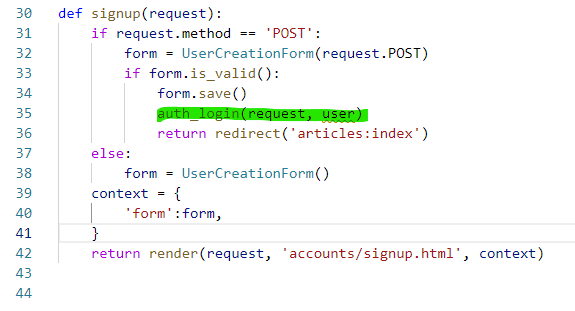
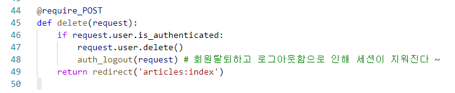
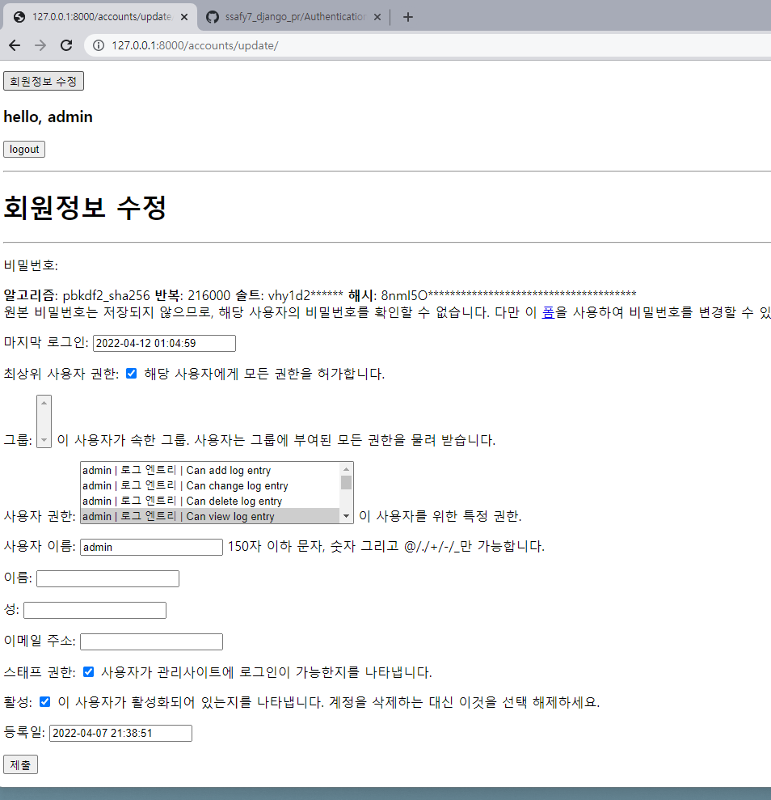
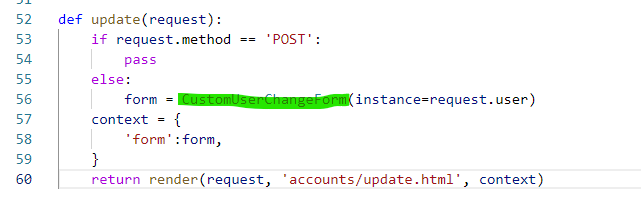
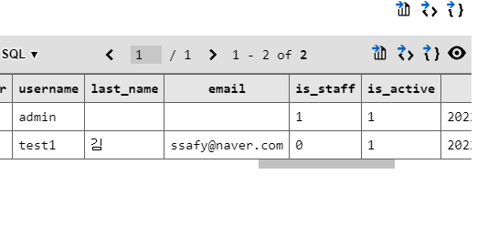
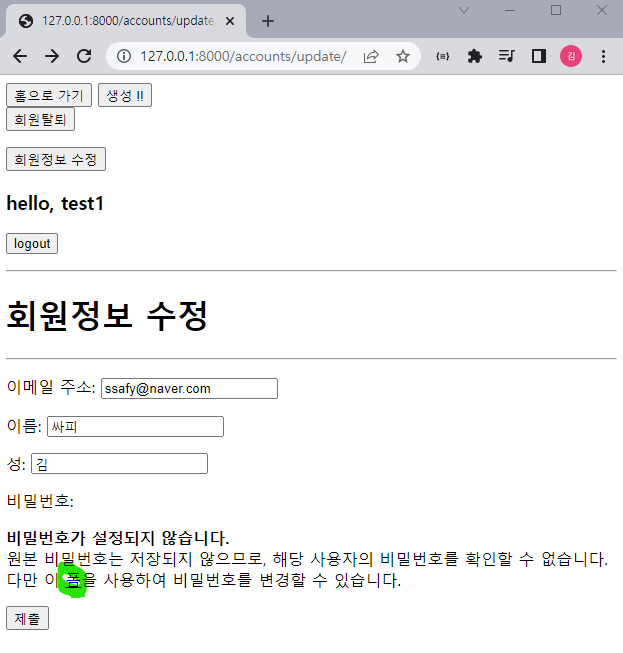
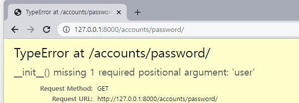
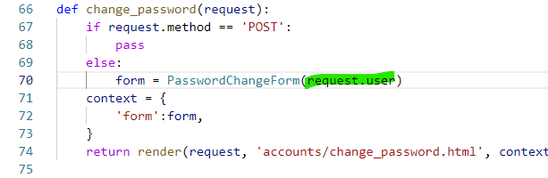
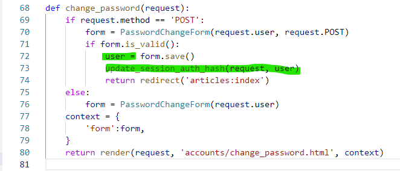

# Authentication System (0411 강의) 오후

## 0. 목차

1. 회원가입 (C)
1. 회원탈퇴 (D)
1. 회원정보 수정 (U)
1. 비밀번호 변경 (U)

## 1. 회원가입

`UserCreationForm` 을 사용할것이다. 권한이 없는 새 user를 생성하도록 함

3개의 필드: `username + pw1 + pw2` (비밀번호 생성 + 비밀번호 확인까지)

accounts/urls.py

```
path('signup/', views.signup, name='signup'),
```

accounts/views.py 빌트인폼 쓰는중이야 알지 ?

```
1. from django.contrib.auth.forms import AuthenticationForm, UserCreationForm 모듈 불러오고
2. def signup(request):
    if request.method == 'POST':
        form = UserCreationForm(request.POST)
        if form.is_valid():
            form.save()
            return redirect('articles:index')
    else:
        form = UserCreationForm()
    context = {
        'form':form,
    }
    return render(request, 'accounts/signup.html', context)
```

공부하면서 느낀생각: 각각 CRUD 뭐에 해당되는지 정리하는 시간을 가지자

accounts/signup.html

```



<h1>회원가입</h1>
<hr>
<form action="" method="POST">
    
    {{ form.as_p }}
    <input type="submit">
</form>

```

이렇게 작성하고 회원가입을 해보기

`test/ 36i42o9))`

#### +) 회원가입과 동시에 자동 로그인 기능 주기



이 코드 추가하기

## 2. 회원탈퇴

db에서 사용자를 삭제하는 과정과 같음 겁먹지망 ~

accounts/urls.py

```
path('delete/', views.delete, name='delete'),
```

accounts/views.py 

```
def delete(request):
    request.user.delete()
    return redirect('articles:index')
```



* 반드시 회원탈퇴후 로그아웃 과정을 진행해주자 !! 이게 반대가 되면 안됨

base.html

```
회원탈퇴 버튼 form으로 만들어주기
<form action="" method="POST">
        
        <input type="submit" value="회원탈퇴">
</form>
```


## 3. 회원정보 수정

### 1. 회원정보 수정 베이스코드

`UserchangeForm` 을 사용할것이다. 

accounts/urls.py

```
path('update/', views.update, name='update'),
```

accounts/views.py 

```
def update(request):
    if request.method == 'POST':
        pass
    else:
        form = UserChangeForm(instance=request.user)
    context = {
        'form':form,
    }
    return render(request, 'accounts/update.html', context)
```

accounts/update.py 

```



<h1>회원정보 수정</h1>
<hr>
<form action="" method="POST">
    
    {{ form.as_p }}
    <input type="submit">
</form>

```


### 2. 회원정보 수정 페이지를 로드해보면?

여기까지는 좋은데 .. 우리가 회원정보 수정을 할 때 아래 사진처럼 이렇게 많은 정보를 수정하라고 주지를 않아



그래서 ModelForm을 커스텀을 좀 해서 

사용자가 바꿀 정보의 부분 란만 비출 수 있도록 지정을 좀 해줘야됨

### 3. account 앱에서 UserchangeForm을 커스텀하기

#### 3.1. accounts dir에 forms.py 생성해주기

근데 지금 우리가 빌트인 form을 쓰고 있어서, 모델 구조가 어떻게 되는지를 몰라 그래서

 1. 모델의 경우는) 유저 모델을 정의하지 않은 상태에서 유저클래스 등록 어떻게? => 함수가있음: 현재 이 프로젝트에서 사용하는 함수를 리턴해주는: 다음과 같은 모듈을 로드하자 `from django.contrib.auth import get_user_model`

    그래서 이제 `model = get_user_model()`  을 적용하면 됨

​	2. fields의 경우는) 회원정보 수정 페이지에 나왔던 모든 정보란이 fields였던 것. 따라서 그 중 원하는 정보만 얻어오기만 하면 됨

[여기가면 필드 뭐있나 볼수잇어](https://docs.djangoproject.com/en/4.0/ref/contrib/auth/)

forms.py

```
from django.contrib.auth.forms import UserChangeForm
from django.contrib.auth import get_user_model

class CustomUserChangeForm(UserChangeForm):
    class Meta:
        model = get_user_model()
        fields = ('email', 'first_name', 'last_name')
```


이렇게 하고 views.py 다시 가서 모듈을 새로 불러와야됨

```
from .forms import CustomUserChangeForm 뷰파이 파일에 추가해주기
```

이거 해주고 이제 알지? UserChangeForm 지정해줬던거 다 CustomUserchangeForm 으로 변경해주기



요런 식으로 재정의를 해주는거잖아 알겟니?

### 4. 다시 베이스코드로 돌아와서: views.py 마무리 지어주기

```
def update(request):
    if request.method == 'POST':
        form = CustomUserChangeForm(request.POST, instance=request.user)
        if form.is_valid():
            form.save()
            return redirect('articles:index')
    else:
        form = CustomUserChangeForm(instance=request.user)
    context = {
        'form':form,
    }
    return render(request, 'accounts/update.html', context)
```

이렇게 하고 update 페이지에서 정보를 변경해서 db 테이블에서 확인하면 아래와 같이 됨:



## 4. 비밀번호 변경 "패스워드 체인지폼이 따로있어" ... 충격



저 링크를 타고 들어가면 /accounts/password/ 링크가 뜸 !! 기본 폼이었던거임 우리는 이걸 건드릴거시다.

PasswordChangeForm을 사용함 !!

#### 4.1. 베이스코드

urls.py 장고가 기본적으로 준 링크를 사용합시다. 

```
path('password/', views.change_password, name='change_password'),
```

views.py

```
def change_password(request):
    if request.method == 'POST':
        pass
    else:
        form = PasswordChangeForm()
    context = {
        'form':form,
    }
    return render(request, 'accounts/change_password.html', context)
```

이렇게 치고 두소 들어가보면?



이런 에러가 뜸 !! => `__init__` 생성자함수에 필수 위치인자 `user`가 누락됐다고 얘기하는중 

: 요거는 조금 다른 구조인거시야

일단 그럼 해결을 먼저 우선 해볼게



이렇게 적어주면 해결되긴함

#### 4.2. 그러면 user가 뭔가요?

PasswordForm은 지금 ModelForm이 아니라 Form을 쓰고 있엇던거임!!!! 

#### 4.3. 뷰파이함수 베이스코드 마무리

```
def change_password(request):
    if request.method == 'POST':
        form = PasswordChangeForm(request.user, request.POST)
        if form.is_valid():
            form.save()
            return redirect('articles:index')
    else:
        form = PasswordChangeForm(request.user)
    context = {
        'form':form,
    }
    return render(request, 'accounts/change_password.html', context)
```

#### 4.4. 이때 비번 변경하면 자동으로 로그아웃 처리가 됨

이게 왜그러냐면 => 비번 변경하면 세션도 바뀜: 그러다보니 기존의 세션과 매칭이 안돼 

서로 다른 유저로 판단이 된다는 뜻 

따라서 `새로운 요청과 세로운 세션으로 업데이트된 객체를 자동으로 가져오는 작업이 필요함`

따라서 우리는 update_session_auth_hash 이라는 함수를 사용합니다. 

뷰파이 마지막으로 변경하기

```
from django.contrib.auth import update_session_auth_hash 불러오고
```



요렇게 해시함수를 넣어주기

해시브라운 먹고싶다

## 5. 데코레이터 정리해주기 !!!

이거는 내일 점심에 하도록 하자.  ..
