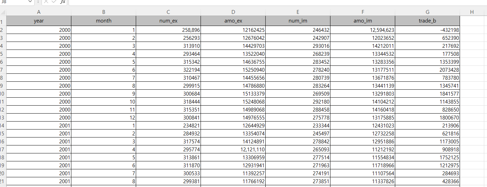
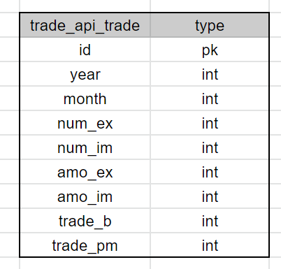
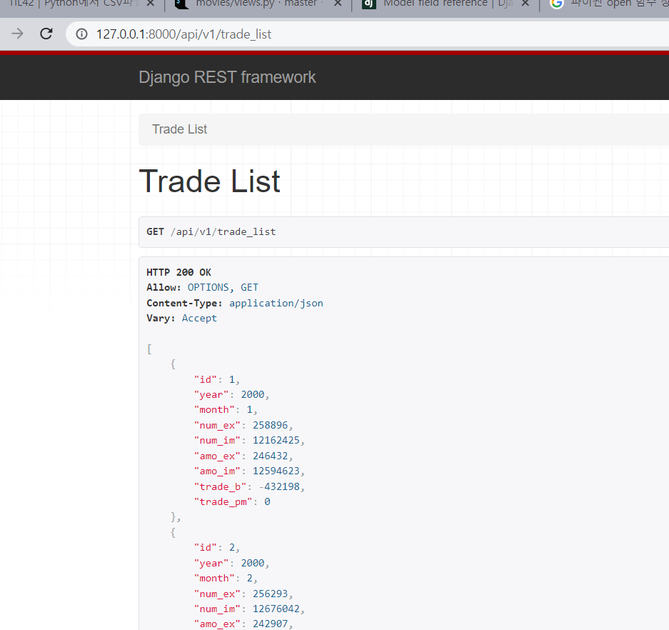
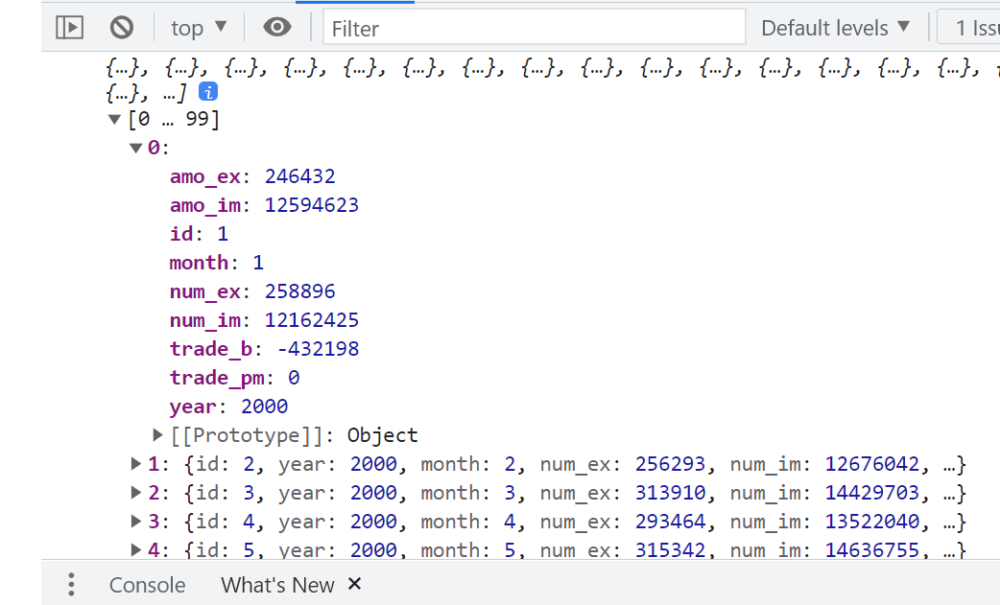
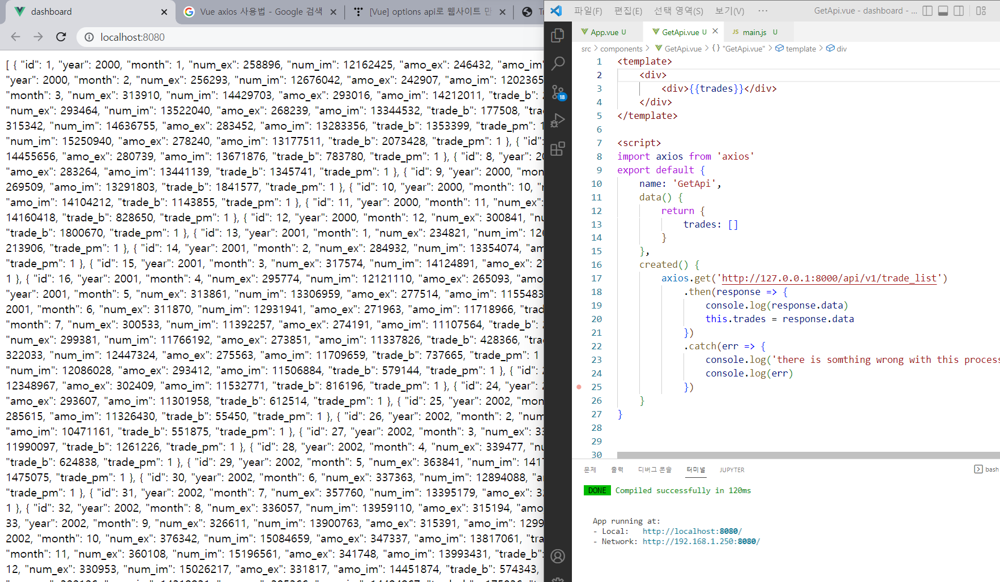
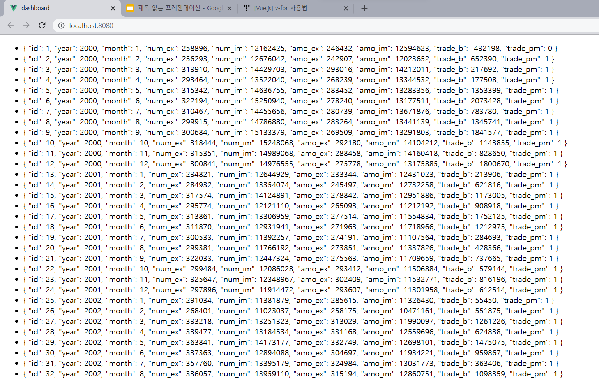
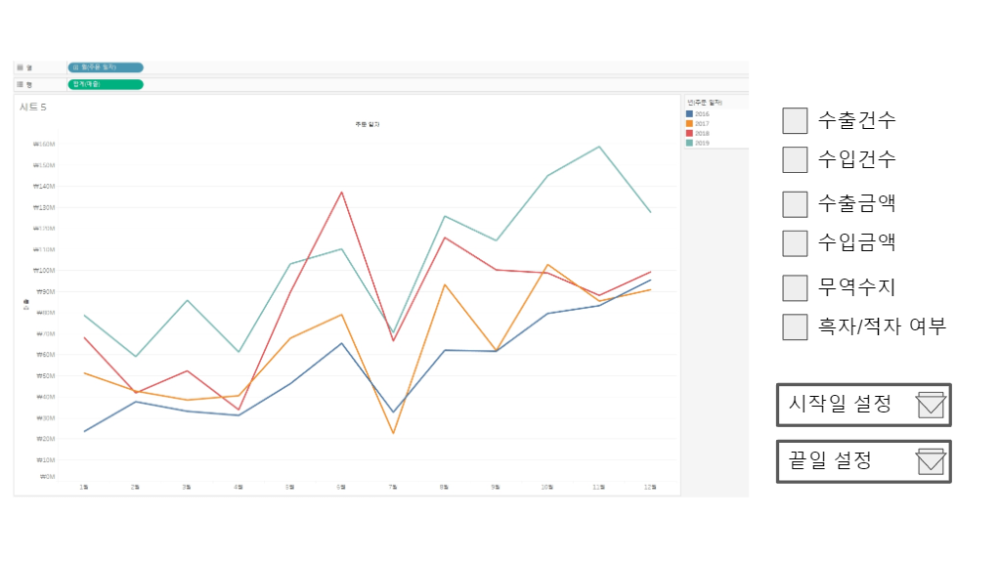

DETP1 Report

작업 과정을 기록한 보고서 페이지입니다. 

## 0. 목차

1. 데이터 전처리 `Excel`

   ✅데이터 source

   ✅데이터 전처리

2. API 구성과정 `Django`

   ✅django 환경구축

   ✅ERD

   ✅csv => DB

   ✅REST API로 보내기

   ✅CORS allow 하기 

3. 대시보드 구성  `Vue3`

   ✅ 데이터 가져오기

   ✅ 대시보드 디자인
   
   ⬜ 대시보드 구성하기

## 1. 데이터 전처리

이번 프로젝트는 batch process는 생략하였습니다. 

1. 데이터 source 구하기: [수출입 무역통계](https://unipass.customs.go.kr/ets/index.do) 에서 데이터를 받아왔습니다. 
   - 수출입총괄 (2000.01 ~ 2022.05) (단위 : 천 불)
     - 수출건수 
     - 수입건수
     - 수출금액
     - 수입금액
     - 무역수지 (수입 - 수출 값)
   - 기본데이터로 계산해서 새로운 컬럼을 생성
     - 적자/흑자여부 (bool)
   - 추가로 구현해보고 싶은 것 (이거는 이후에 하자)
     - 수출이 가장 높은 달
     - 수입이 가장 높은 달

 

2. 데이터 전처리하기

   xls 파일을 csv로 바꾸고 바로  django model에 넣으려고 함

   1. 컬럼명 변경 (exel에서 작업)

      | 수출건수       | num_ex   |
      | -------------- | -------- |
      | 수입건수       | num_im   |
      | 수출금액       | amo_ex   |
      | 수입금액       | amo_im   |
      | 무역수지       | trade_b  |
      | 흑자/적자 여부 | trade_pm |
   
   2. "기간" 컬럼 => `연 / 월` 나누기
   
   완성 데이터:
   
   

​		이 데이터를 이제 csv 형식으로 바꿀 예정

## 2. API 구성과정

1. django 환경 만들기

   project명 : server

   app 명 : trade_api 

   app 만들고 settings.py에 등록

   rest framework 가져와서 역시 settings.py에 등록

2. ERD

   

   +) trade_pm은 무역수지가 음수면 0, 양수면 1으로 기입하였음

3. csv를 DB에 담기

   [이 블로그를 참고함](https://jeleedev.tistory.com/152)

4. REST API로 내보내기

   

잘 나왔음

5. `CORS allow` => backEnd 단에서 api를 받는 클라이언트 주소를 등록하는 과정이 필요함: [참고](https://pypi.org/project/django-cors-headers/)

## 3. 대시보드 구성

1. 데이터 가져오기

component에서 axios로 api를 받아왔음

잘 받아옴ㅎㅎ

뿌리는것도 성공!!

v-for문으로 정렬함

2. 대시보드 디자인

​	라인차트는 [Chart.js](https://pinokio0702.tistory.com/388) 사용할 예정 [참고](https://velog.io/@rhak39/Vue-Chart.js-%EC%A0%95%EB%A6%AC)

개별 데이터를 선택해서 조회할 수 있도록 각각 체크박스를 달 것이고

조회하는 범위도 시작날짜, 끝 날짜를 따로 콤보박스로 둘 예정
