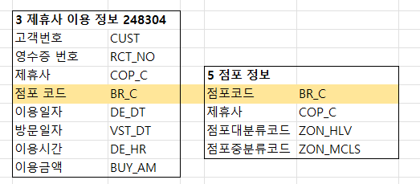
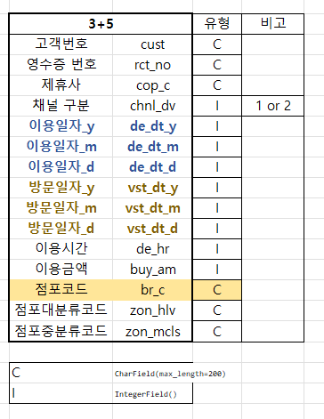
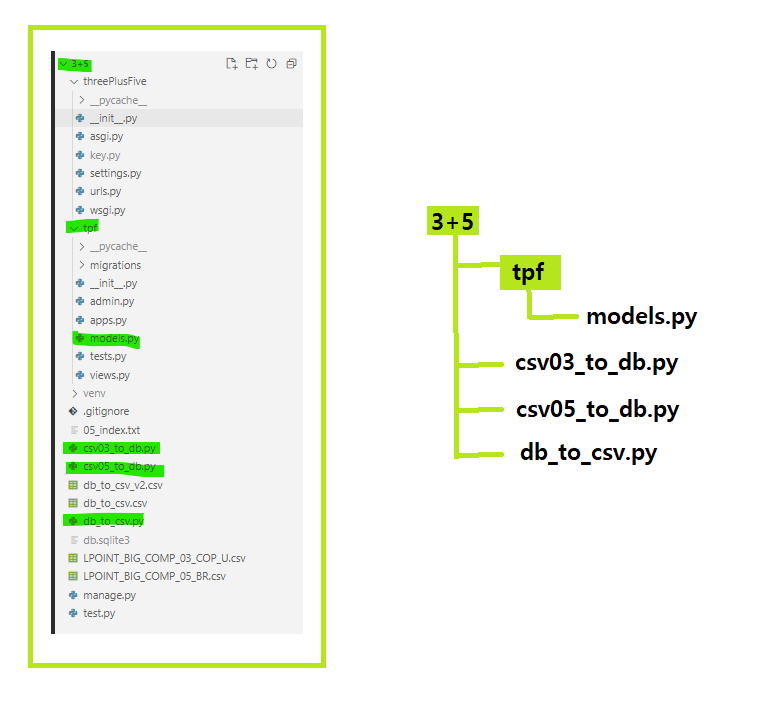
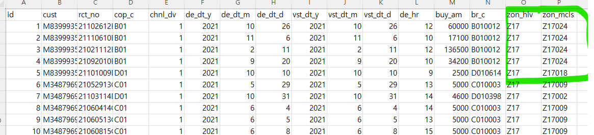
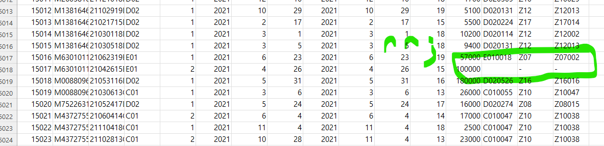

# [2022. 06. 29] Toy Project 2

## 0. 목차

1. 데이터 설명
2. 코드 설명

## 1.데이터 설명

사용한 데이터 : `3번파일`  `5번파일`  => 모두 csv 형태로 되어있음

**개요**



위처럼 나뉘어져 있는 파일을 아래와 같이 합치는 작업을 하였음



1. 이용일자와 방문일자는 `연/월/일` 컬럼으로 나눴음
2. 3번 파일의 점포코드와 5번 파일의 점포코드를 기준으로 데이터를 연결하였음

## 2. 코드 설명

이 프로젝트에서 주로 사용한 파일은 4개 : 

3+5 > tpf > **`models.py`** : 모델 구성하는 파일

3+5 > **`csv03_to_db.py`** : 5번 csv 에서 받아온 데이터와 3번 csv에서 받아온 데이터를 합치는 

3+5 > **`csv05_to_db.py`** : 5번 csv 파일의 데이터를 받아오는

3+5 > **`db_to_csv.py`** : 완성한 db를 csv로 변환하는 



### 1. 과정 설명

1. 5번 파일에서 데이터를 받아 django 모델 **(BR)**에 담기
2. 3번 + 5번 데이터를 합친 컬럼대로 모델 **(CopUBr)**을 만들기
3. 데이터를 모델에 담아 db 생성하기
4. 완성한 db를 csv 로 내보내기

<br>

### 2. ERD 및 모델 구성 (models.py) 

```python
class CopUBr(models.Model):
    cust = models.CharField(max_length=200)
    rct_no = models.CharField(max_length=200)
    cop_c = models.CharField(max_length=200)
    chnl_dv = models.IntegerField()
    de_dt_y = models.IntegerField()
    de_dt_m = models.IntegerField()
    de_dt_d = models.IntegerField()
    vst_dt_y = models.IntegerField()
    vst_dt_m = models.IntegerField()
    vst_dt_d = models.IntegerField()
    de_hr = models.IntegerField()
    buy_am = models.IntegerField()
    br_c = models.CharField(max_length=200)
    zon_hlv = models.CharField(max_length=200)
    zon_mcls = models.CharField(max_length=200)

class BR(models.Model):
    br_c = models.CharField(max_length=200)
    zon_hlv = models.CharField(max_length=200)
    zon_mcls = models.CharField(max_length=200)
```


`BR ` 모델은 5번 파일의 데이터를 담기 위한 것

`CopUBr` 모델은 3번과 5번을 연결한 데이터를 담기 위한 것

<br>

### 3. 코드 설명

[csv05_to_db.py](3+5/csv05_to_db.py )  5번 파일에서 데이터를 받아 django 모델 **(BR)**에 담는 작업

[csv03_to_db.py](3+5/csv03_to_db.py  )  3번 + 5번 데이터 합치는 작업

[db_to_csv.py ](3+5/db_to_csv.py ) 완성한 db를 csv 로 내보내는 작업

## 결과물 [파일](3+5/db_to_csv_v2.csv)



캡쳐 뜨다가 발견한 실수 !!!!!



[csv03_to_db.py](3+5/csv03_to_db.py  )  에서 예외처리할 때 br_c 값은 생각 안하고 그냥 db에 넣어서 공란이 생겨버렸다 ..

다음에는 정신차리고 코드 짜기ㅠㅠ


